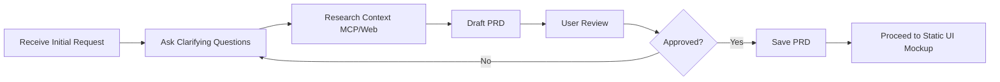
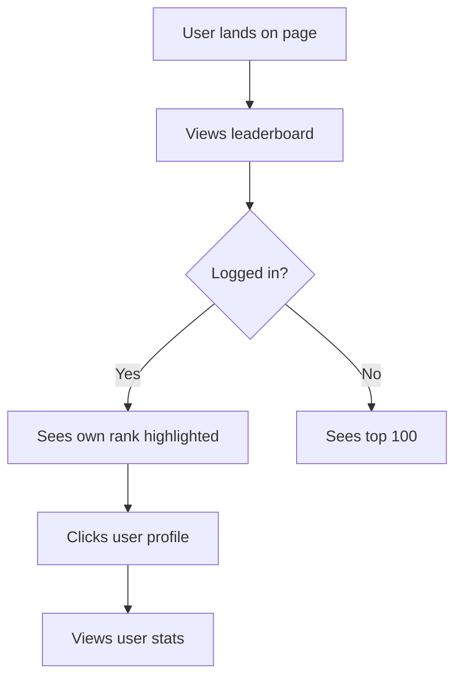
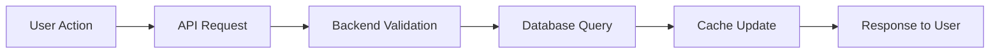

# 01 - Product Requirements Document (PRD) Creation Workflow
**Version:** 1.0.0
**Last Updated:** 2025-10-10
**Purpose:** Standardized process for creating comprehensive PRDs for any project type

---

## ⚠️ **DO NOT MODIFY THIS DOCUMENT**

**This is a REFERENCE document. Claude Code should READ and FOLLOW this document, but NEVER modify it unless the user explicitly requests an update.**

**Exception:** Only modify if the user specifically asks: "Update the Claude DOCS" or "Modify 01_PRD_CREATION.md"

---

## 📋 OVERVIEW

This document guides Claude Code through creating a Product Requirements Document (PRD) that clearly defines WHAT needs to be built and WHY, without prescribing HOW to build it. The PRD serves as the foundation for all subsequent work.

**Target Audience:** The PRD should be written as if explaining to a junior developer who understands code but needs explicit, unambiguous requirements.

---

## ⚡ QUICK REFERENCE



---

## 🎯 STEP 1: RECEIVE INITIAL REQUEST

When a user requests a new feature or project, Claude Code must:

1. **Acknowledge** the request
2. **Use TodoWrite** to track the PRD creation task
3. **Immediately proceed** to Step 2 (ask questions)

### Example Initial Requests:
- "I want to add a leaderboard to my chess game"
- "Create a tax deduction calculator"
- "Build a user authentication system"
- "Add dark mode to my app"

---

## 🔍 STEP 2: ASK CLARIFYING QUESTIONS

**CRITICAL:** Do NOT skip this step. Always ask targeted questions to understand requirements fully.

### Question Framework:

#### A. Problem & Goals
```
- What problem does this solve for users?
- What is the primary goal of this feature?
- What does success look like?
- Are there any existing solutions you've seen that you like/dislike?
```

#### B. Target Users
```
- Who will use this feature?
- What is their technical skill level?
- What devices/platforms will they use? (desktop/mobile/both)
- Are there accessibility requirements?
```

#### C. Core Functionality
```
- What are the MUST-HAVE features (MVP)?
- What are the NICE-TO-HAVE features (future)?
- What workflows/user journeys are involved?
- What are the primary actions users will take?
```

#### D. Data Requirements
```
- What data needs to be stored?
- What data needs to be displayed?
- Are there any data sources/integrations? (APIs, databases, etc.)
- What are the data retention requirements?
```

#### E. Technical Context
```
- Does this integrate with existing systems? (List them)
- Are there performance requirements? (speed, scale, etc.)
- Are there specific technologies you want to use?
- What is the expected user load? (10 users? 10k users?)
```

#### F. Design & UX
```
- Do you have design references? (screenshots, mockups, websites to emulate)
- What is the desired look and feel? (modern, minimal, playful, professional)
- Are there brand colors/guidelines to follow?
- Any specific UI components needed? (modals, dropdowns, tables, etc.)
```

#### G. Scope Boundaries
```
- What is explicitly OUT of scope for this release?
- What are the dealbreakers (must not do)?
- What is the timeline/urgency?
- What is the priority vs. other work?
```

#### H. Edge Cases & Constraints
```
- What happens if [error scenario]?
- What are the rate limits/quotas?
- What are the security/privacy requirements?
- Are there compliance requirements? (GDPR, HIPAA, etc.)
```

### Example Question Set:
```markdown
To create a comprehensive PRD for the leaderboard feature, I need to understand:

**Problem & Goals:**
1. What problem does the leaderboard solve? (e.g., engagement, competition, recognition)
2. What defines success for this feature?

**Users:**
3. Is this for all users or specific user types?
4. Mobile, desktop, or both?

**Core Functionality:**
5. What metrics determine leaderboard rank? (wins, rating, puzzles solved, etc.)
6. Should it be global, friends-only, or both?
7. How often should rankings update? (real-time, hourly, daily)
8. How many top players should be displayed?

**Data:**
9. Do you already have user stats stored, or do we need to track them?
10. Should historical data be preserved? (e.g., "Top Player of March 2025")

**Design:**
11. Do you have reference leaderboards you like? (e.g., chess.com, lichess)
12. Should user profiles be clickable from the leaderboard?

**Scope:**
13. What's out of scope for v1? (e.g., filtering, time periods, achievements)
14. Timeline expectations?
```

---

## 📚 STEP 3: RESEARCH CONTEXT (Use MCPs!)

Before drafting the PRD, Claude Code MUST:

### A. Check for Existing Patterns
```bash
# If this is an existing project:
1. Use Grep to search for similar features
2. Read relevant existing code
3. Check project documentation
```

### B. Research Best Practices
```bash
# Use Perplexity MCP:
"What are best practices for [feature type] in [tech stack]?"

# Use Context7 MCP:
"Get documentation for [library/framework] related to [feature]"

# Use WebSearch:
"Modern [feature type] implementation examples 2025"
```

### C. Check Existing MCPs/Tools
```bash
# Consult 08_MCP_TOOLS_REGISTRY.md to see if relevant MCPs exist
# Example: Building auth? Check if there's an Auth MCP available
```

### D. Verify Tech Stack
```bash
# Consult 09_LIBRARY_REGISTRY.md for recommended libraries
# Use WebSearch to verify library is current and maintained
```

---

## 📝 STEP 4: DRAFT THE PRD

Use this template to structure the PRD:

````markdown
# Product Requirements Document: [Feature Name]

**Created:** [Date]
**Author:** Claude Code
**Status:** Draft
**Target Release:** [TBD or specific date]

---

## 1. Introduction / Overview

### 1.1 Background
[Why are we building this? What's the context?]

### 1.2 Problem Statement
[What problem does this solve for users?]

### 1.3 Goals
- **Primary Goal:** [Main objective]
- **Secondary Goals:** [Additional objectives]

### 1.4 Success Metrics
- [How will we measure success?]
- [Quantifiable metrics: e.g., "80% of users engage with feature in first week"]

---

## 2. User Stories

### 2.1 Primary User Stories
```
As a [user type],
I want to [action],
So that [benefit/outcome].

Acceptance Criteria:
- [ ] [Specific, testable criteria]
- [ ] [Another criteria]
```

### 2.2 Additional User Stories
[List 3-5 more user stories covering different use cases]

---

## 3. Functional Requirements

### 3.1 Core Features (MVP - Must Have)
1. **[Feature Name]**
   - Description: [What it does]
   - User Interaction: [How users interact with it]
   - Expected Behavior: [What happens]
   - Acceptance Criteria:
     - [ ] [Specific criteria]

2. **[Next Feature]**
   - ...

### 3.2 Secondary Features (Nice to Have)
[Features for future iterations]

---

## 4. Non-Functional Requirements

### 4.1 Performance
- **Load Time:** [e.g., "Page loads in < 2 seconds"]
- **Responsiveness:** [e.g., "60fps animations"]
- **Scalability:** [e.g., "Support 10k concurrent users"]

### 4.2 Security
- **Authentication:** [Required? Type?]
- **Authorization:** [Who can access what?]
- **Data Protection:** [Encryption, privacy requirements]
- **Compliance:** [OWASP, GDPR, etc.]

### 4.3 Usability
- **Accessibility:** [WCAG level, screen reader support]
- **Mobile-First:** [Yes/No, responsive requirements]
- **Internationalization:** [Multi-language support?]

### 4.4 Reliability
- **Uptime:** [e.g., "99.9% uptime"]
- **Error Handling:** [Graceful degradation, error messages]
- **Data Integrity:** [Backup, validation requirements]

---

## 5. User Interface / User Experience

### 5.1 Key Screens/Views
1. **[Screen Name]** (e.g., "Leaderboard View")
   - Purpose: [What this screen does]
   - Components: [List UI elements: table, filters, search, etc.]
   - User Actions: [What users can do here]
   - Navigation: [How users get here and where they can go]

2. **[Next Screen]**
   - ...

### 5.2 User Workflows


### 5.3 Design References
- [Link to mockups, Figma, or reference sites]
- [Description of desired aesthetic: modern, minimal, playful, etc.]

---

## 6. Data Requirements

### 6.1 Data Models
```typescript
// Example: Leaderboard Entry
interface LeaderboardEntry {
  userId: string;
  username: string;
  rank: number;
  score: number;
  gamesPlayed: number;
  winRate: number;
  lastActive: Date;
  avatarUrl?: string;
}
```

### 6.2 Data Sources
- **Database:** [e.g., Supabase Postgres]
- **External APIs:** [List any integrations]
- **Cache Layer:** [Redis, CDN, etc.]

### 6.3 Data Flow


---

## 7. Technical Considerations

### 7.1 Recommended Stack
[Based on 09_LIBRARY_REGISTRY.md and project type]
- **Frontend:** [e.g., Next.js + Tailwind]
- **Backend:** [e.g., FastAPI or Next.js API Routes]
- **Database:** [e.g., Supabase Postgres]
- **State Management:** [e.g., Zustand]
- **Testing:** [e.g., Playwright + Vitest]

### 7.2 API Endpoints (If applicable)
```
GET    /api/leaderboard?limit=100&page=1
GET    /api/leaderboard/user/:userId
POST   /api/leaderboard/update (internal only)
```

### 7.3 Third-Party Integrations
- [List any external services: Stripe, SendGrid, etc.]

---

## 8. Out of Scope (Non-Goals)

What this PRD explicitly does NOT include:
- ❌ [Feature/functionality not in v1]
- ❌ [Another excluded item]

These may be considered for future iterations.

---

## 9. Open Questions & Risks

### 9.1 Open Questions
- [ ] [Question that needs answering before implementation]
- [ ] [Another question]

### 9.2 Risks & Mitigation
| Risk | Impact | Mitigation |
|------|--------|------------|
| [e.g., "High database load"] | High | [e.g., "Implement caching layer"] |
| [Another risk] | Medium | [Mitigation strategy] |

---

## 10. Approval & Sign-Off

**Reviewed By:** [User name]
**Approved:** [ ] Yes [ ] No
**Date:** [Date]
**Notes:** [Any feedback or changes requested]

---

## 11. Next Steps

After PRD approval:
1. ✅ Proceed to `02_STATIC_UI_MOCKUP.md`
2. ✅ Build complete static UI with placeholder data
3. ✅ Get approval before implementation

---

## Appendix A: Research References

[Links to research, articles, competitor analysis, etc.]

---

## Appendix B: Change Log

| Date | Version | Changes | Author |
|------|---------|---------|--------|
| [Date] | 1.0 | Initial creation | Claude Code |

````

---

## 💾 STEP 5: SAVE THE PRD

Once the PRD is drafted:

```bash
# Save to project's /docs directory or /tasks directory
# Filename format: PRD-[feature-name]-YYYY-MM-DD.md
# Example: PRD-leaderboard-2025-10-10.md
```

If the project has a `/tasks/` directory, save there. Otherwise, create `/docs/` directory.

---

## ✅ STEP 6: USER REVIEW & APPROVAL

**CRITICAL APPROVAL GATE:**

1. Present the PRD to the user
2. Ask: "Please review this PRD. Does it accurately capture the requirements? Any changes needed?"
3. **WAIT for user approval before proceeding**
4. If changes requested, update PRD and repeat review
5. Once approved, update PRD status to "Approved" and add approval date

---

## 📊 STEP 7: NEXT STEPS

After PRD approval, immediately:

1. Mark PRD task as completed in TodoWrite
2. Inform user: "PRD approved! Next step: Creating static UI mockup (see 02_STATIC_UI_MOCKUP.md)"
3. Ask: "Ready to proceed with static UI mockup?"
4. If yes, proceed to `02_STATIC_UI_MOCKUP.md`

---

## 🧪 PRD QUALITY CHECKLIST

Before presenting the PRD to the user, verify:

- [ ] All clarifying questions have been asked and answered
- [ ] Research was conducted (MCP/WebSearch)
- [ ] User stories are specific and testable
- [ ] Acceptance criteria are clear and measurable
- [ ] Non-functional requirements are defined
- [ ] UI/UX workflows are documented
- [ ] Data models are specified
- [ ] Out of scope items are listed
- [ ] Open questions/risks are identified
- [ ] Technical stack is recommended (based on 09_LIBRARY_REGISTRY.md)
- [ ] Document is written for junior developer audience (no assumptions)
- [ ] Next steps are clear

---

## 📚 EXAMPLES

### Example 1: Leaderboard Feature

````markdown
# Product Requirements Document: Chess Leaderboard

**Created:** 2025-10-10
**Author:** Claude Code
**Status:** Approved
**Target Release:** Sprint 2

---

## 1. Introduction / Overview

### 1.1 Background
Users have requested a way to see how they rank against other players. Currently, there's no visibility into comparative performance.

### 1.2 Problem Statement
Players want to:
- See how they rank globally
- Compare their performance to friends
- Feel motivated to improve through competition

### 1.3 Goals
- **Primary Goal:** Increase user engagement by 30% through competitive motivation
- **Secondary Goals:**
  - Provide social proof for high-performing players
  - Create retention mechanism (users check back to see rank changes)

### 1.4 Success Metrics
- 70% of active users view leaderboard within first week
- 20% increase in daily games played
- 15% increase in user session duration

[... continue with full PRD template ...]
````

---

## 🚨 COMMON MISTAKES TO AVOID

| Mistake | Why It's Bad | How to Fix |
|---------|--------------|------------|
| Skipping clarifying questions | Leads to incorrect assumptions | Always ask questions in Step 2 |
| Prescribing HOW to build | PRD should focus on WHAT/WHY | Remove implementation details |
| Vague acceptance criteria | Can't verify completion | Make criteria specific and testable |
| No out-of-scope section | Scope creep risk | Explicitly state what's excluded |
| Missing user stories | No user perspective | Include 3-5 diverse user stories |
| No research | Reinventing the wheel | Use MCPs and WebSearch |

---

## 🔗 RELATED DOCUMENTS

- [MASTER_WORKFLOW.md](MASTER_WORKFLOW.md) - Overall workflow
- [02_STATIC_UI_MOCKUP.md](02_STATIC_UI_MOCKUP.md) - Next step after PRD
- [08_MCP_TOOLS_REGISTRY.md](08_MCP_TOOLS_REGISTRY.md) - Available MCPs for research
- [09_LIBRARY_REGISTRY.md](09_LIBRARY_REGISTRY.md) - Recommended tech stacks

---

**After completing this step, proceed to:** `02_STATIC_UI_MOCKUP.md`
