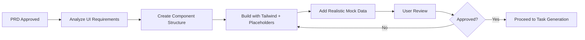

# 02 - Static UI Mockup Creation Workflow
**Version:** 1.0.0
**Last Updated:** 2025-10-10
**Purpose:** Build complete, non-functional UI mockup with Tailwind CSS before any implementation

---

## ⚠️ **DO NOT MODIFY THIS DOCUMENT**

**This is a REFERENCE document. Claude Code should READ and FOLLOW this document, but NEVER modify it unless the user explicitly requests an update.**

**Exception:** Only modify if the user specifically asks: "Update the Claude DOCS" or "Modify 02_STATIC_UI_MOCKUP.md"

---

## 📋 OVERVIEW

**Critical Principle:** Build the COMPLETE user interface with placeholder data BEFORE implementing ANY functionality. This eliminates confusion, allows for early visual feedback, and ensures alignment on design before investing in logic.

**Goal:** Create a fully styled, visually complete HTML/CSS mockup that shows exactly what the final product will look like, with NO JavaScript functionality (or minimal for navigation only).

---

## ⚡ QUICK REFERENCE



---

## 🎯 WHY STATIC UI FIRST?

### Benefits:
1. **Visual Clarity:** User sees EXACTLY what they're getting
2. **Early Feedback:** Design changes are cheap now, expensive later
3. **Eliminates Confusion:** No "I thought it would look like..." surprises
4. **Faster Development:** Clear target for implementation
5. **Better Planning:** Reveals complexity early (e.g., responsive behavior)

### Anti-Pattern (What NOT to do):
```
❌ Build API → Build logic → Build UI → User says "This isn't what I wanted"
✅ Build UI mockup → Get approval → Build logic → Perfect result
```

---

## 📐 STEP 1: ANALYZE UI REQUIREMENTS FROM PRD

Extract all UI-related information from the PRD:

### Checklist:
- [ ] List all screens/views mentioned
- [ ] Identify all UI components needed (tables, forms, modals, etc.)
- [ ] Note responsive requirements (mobile/desktop/tablet)
- [ ] Extract design references (if any)
- [ ] Identify user workflows (page-to-page navigation)
- [ ] List all data that needs to be displayed

### Example (Leaderboard):
```markdown
**Screens:**
- Leaderboard view (main)
- User profile modal (optional)

**Components:**
- Header with navigation
- Leaderboard table (rank, avatar, username, stats)
- Filter controls (time period, friends only)
- Search bar
- Pagination controls

**Responsive:**
- Desktop: Full table
- Mobile: Simplified card view

**Design Reference:**
- Modern, minimal aesthetic
- Brand colors: #3B82F6 (primary), #1F2937 (dark)
```

---

## 🛠️ STEP 2: SET UP TAILWIND CSS

### Option A: Standalone HTML Files (Quick Prototypes)
```html
<!DOCTYPE html>
<html lang="en">
<head>
    <meta charset="UTF-8">
    <meta name="viewport" content="width=device-width, initial-scale=1.0">
    <title>Feature Mockup - [Feature Name]</title>
    <script src="https://cdn.tailwindcss.com"></script>
    <script>
        tailwind.config = {
            theme: {
                extend: {
                    colors: {
                        primary: '#3B82F6',
                        secondary: '#1F2937',
                    }
                }
            }
        }
    </script>
</head>
<body class="bg-gray-50">
    <!-- Your mockup here -->
</body>
</html>
```

### Option B: Next.js/SvelteKit Project (Recommended for Production)
```bash
# If using Next.js
npx create-next-app@latest mockup --typescript --tailwind
cd mockup
npm run dev

# Create mockup in app/mockup/page.tsx or pages/mockup.tsx
```

---

## 🎨 STEP 3: CREATE COMPONENT STRUCTURE

### Best Practice: Component-First Approach

1. **Identify Reusable Components:**
   ```
   - Button (primary, secondary, ghost)
   - Card
   - Table
   - Input field
   - Modal
   - Avatar
   - Badge
   - Navigation
   ```

2. **Build Component Library First:**

```html
<!-- components.html - Reusable component styles -->

<!-- Button Variants -->
<button class="px-4 py-2 bg-blue-600 text-white rounded-lg hover:bg-blue-700 transition">
    Primary Button
</button>

<button class="px-4 py-2 border border-gray-300 text-gray-700 rounded-lg hover:bg-gray-50 transition">
    Secondary Button
</button>

<!-- Card -->
<div class="bg-white rounded-lg shadow-md p-6">
    <h3 class="text-lg font-semibold mb-2">Card Title</h3>
    <p class="text-gray-600">Card content goes here</p>
</div>

<!-- Avatar -->


<!-- Badge -->
<span class="px-2 py-1 bg-green-100 text-green-800 text-xs font-medium rounded-full">
    Active
</span>
```

---

## 📝 STEP 4: BUILD COMPLETE MOCKUP WITH PLACEHOLDERS

### Golden Rule: Show REALISTIC Data

Use placeholder data that looks like real production data, not "Lorem ipsum" or "Test User 1, 2, 3".

### Example: Leaderboard Mockup

````html
<!DOCTYPE html>
<html lang="en">
<head>
    <meta charset="UTF-8">
    <meta name="viewport" content="width=device-width, initial-scale=1.0">
    <title>Leaderboard Mockup</title>
    <script src="https://cdn.tailwindcss.com"></script>
</head>
<body class="bg-gray-50 min-h-screen">
    <!-- Navigation -->
    <nav class="bg-white shadow-sm border-b border-gray-200">
        <div class="max-w-7xl mx-auto px-4 sm:px-6 lg:px-8">
            <div class="flex justify-between items-center h-16">
                <div class="flex items-center gap-8">
                    <h1 class="text-xl font-bold text-gray-900">ChessQuest</h1>
                    <div class="hidden md:flex gap-6">
                        <a href="#" class="text-gray-600 hover:text-gray-900">Play</a>
                        <a href="#" class="text-gray-600 hover:text-gray-900">Puzzles</a>
                        <a href="#" class="text-blue-600 font-medium">Leaderboard</a>
                    </div>
                </div>
                <div class="flex items-center gap-4">
                    <button class="px-4 py-2 text-gray-700 hover:bg-gray-100 rounded-lg">
                        Sign In
                    </button>
                </div>
            </div>
        </div>
    </nav>

    <!-- Main Content -->
    <main class="max-w-7xl mx-auto px-4 sm:px-6 lg:px-8 py-8">
        <!-- Header -->
        <div class="mb-8">
            <h2 class="text-3xl font-bold text-gray-900 mb-2">Leaderboard</h2>
            <p class="text-gray-600">Top players ranked by rating</p>
        </div>

        <!-- Filters -->
        <div class="bg-white rounded-lg shadow-sm p-4 mb-6">
            <div class="flex flex-col sm:flex-row gap-4 items-start sm:items-center justify-between">
                <div class="flex gap-2">
                    <button class="px-4 py-2 bg-blue-600 text-white rounded-lg text-sm font-medium">
                        Global
                    </button>
                    <button class="px-4 py-2 text-gray-700 hover:bg-gray-100 rounded-lg text-sm font-medium">
                        Friends
                    </button>
                    <button class="px-4 py-2 text-gray-700 hover:bg-gray-100 rounded-lg text-sm font-medium">
                        Country
                    </button>
                </div>
                <div class="flex gap-2">
                    <select class="px-4 py-2 border border-gray-300 rounded-lg text-sm focus:outline-none focus:ring-2 focus:ring-blue-500">
                        <option>This Month</option>
                        <option>All Time</option>
                        <option>This Week</option>
                    </select>
                    <input type="search"
                           placeholder="Search players..."
                           class="px-4 py-2 border border-gray-300 rounded-lg text-sm focus:outline-none focus:ring-2 focus:ring-blue-500">
                </div>
            </div>
        </div>

        <!-- Leaderboard Table (Desktop) -->
        <div class="hidden md:block bg-white rounded-lg shadow-sm overflow-hidden">
            <table class="w-full">
                <thead class="bg-gray-50 border-b border-gray-200">
                    <tr>
                        <th class="px-6 py-3 text-left text-xs font-medium text-gray-500 uppercase tracking-wider">
                            Rank
                        </th>
                        <th class="px-6 py-3 text-left text-xs font-medium text-gray-500 uppercase tracking-wider">
                            Player
                        </th>
                        <th class="px-6 py-3 text-left text-xs font-medium text-gray-500 uppercase tracking-wider">
                            Rating
                        </th>
                        <th class="px-6 py-3 text-left text-xs font-medium text-gray-500 uppercase tracking-wider">
                            Games
                        </th>
                        <th class="px-6 py-3 text-left text-xs font-medium text-gray-500 uppercase tracking-wider">
                            Win Rate
                        </th>
                    </tr>
                </thead>
                <tbody class="divide-y divide-gray-200">
                    <!-- Top 3 with special styling -->
                    <tr class="bg-yellow-50 hover:bg-yellow-100 transition">
                        <td class="px-6 py-4 whitespace-nowrap">
                            <div class="flex items-center">
                                <span class="text-2xl">🥇</span>
                                <span class="ml-2 text-sm font-medium text-gray-900">1</span>
                            </div>
                        </td>
                        <td class="px-6 py-4 whitespace-nowrap">
                            <div class="flex items-center">
                                
                                <div class="ml-4">
                                    <div class="text-sm font-medium text-gray-900">Magnus Carlsen</div>
                                    <div class="text-xs text-gray-500">Norway</div>
                                </div>
                            </div>
                        </td>
                        <td class="px-6 py-4 whitespace-nowrap">
                            <div class="text-sm font-semibold text-gray-900">2847</div>
                        </td>
                        <td class="px-6 py-4 whitespace-nowrap text-sm text-gray-500">
                            1,234
                        </td>
                        <td class="px-6 py-4 whitespace-nowrap">
                            <span class="px-2 py-1 text-xs font-medium rounded-full bg-green-100 text-green-800">
                                68.5%
                            </span>
                        </td>
                    </tr>

                    <tr class="bg-gray-50 hover:bg-gray-100 transition">
                        <td class="px-6 py-4 whitespace-nowrap">
                            <div class="flex items-center">
                                <span class="text-2xl">🥈</span>
                                <span class="ml-2 text-sm font-medium text-gray-900">2</span>
                            </div>
                        </td>
                        <td class="px-6 py-4 whitespace-nowrap">
                            <div class="flex items-center">
                                
                                <div class="ml-4">
                                    <div class="text-sm font-medium text-gray-900">Hikaru Nakamura</div>
                                    <div class="text-xs text-gray-500">USA</div>
                                </div>
                            </div>
                        </td>
                        <td class="px-6 py-4 whitespace-nowrap">
                            <div class="text-sm font-semibold text-gray-900">2789</div>
                        </td>
                        <td class="px-6 py-4 whitespace-nowrap text-sm text-gray-500">
                            2,456
                        </td>
                        <td class="px-6 py-4 whitespace-nowrap">
                            <span class="px-2 py-1 text-xs font-medium rounded-full bg-green-100 text-green-800">
                                65.2%
                            </span>
                        </td>
                    </tr>

                    <tr class="bg-orange-50 hover:bg-orange-100 transition">
                        <td class="px-6 py-4 whitespace-nowrap">
                            <div class="flex items-center">
                                <span class="text-2xl">🥉</span>
                                <span class="ml-2 text-sm font-medium text-gray-900">3</span>
                            </div>
                        </td>
                        <td class="px-6 py-4 whitespace-nowrap">
                            <div class="flex items-center">
                                
                                <div class="ml-4">
                                    <div class="text-sm font-medium text-gray-900">Fabiano Caruana</div>
                                    <div class="text-xs text-gray-500">USA</div>
                                </div>
                            </div>
                        </td>
                        <td class="px-6 py-4 whitespace-nowrap">
                            <div class="text-sm font-semibold text-gray-900">2766</div>
                        </td>
                        <td class="px-6 py-4 whitespace-nowrap text-sm text-gray-500">
                            987
                        </td>
                        <td class="px-6 py-4 whitespace-nowrap">
                            <span class="px-2 py-1 text-xs font-medium rounded-full bg-green-100 text-green-800">
                                64.8%
                            </span>
                        </td>
                    </tr>

                    <!-- Regular rows (4-10) -->
                    <tr class="hover:bg-gray-50 transition">
                        <td class="px-6 py-4 whitespace-nowrap text-sm font-medium text-gray-900">4</td>
                        <td class="px-6 py-4 whitespace-nowrap">
                            <div class="flex items-center">
                                
                                <div class="ml-4">
                                    <div class="text-sm font-medium text-gray-900">Ding Liren</div>
                                    <div class="text-xs text-gray-500">China</div>
                                </div>
                            </div>
                        </td>
                        <td class="px-6 py-4 whitespace-nowrap text-sm font-semibold text-gray-900">2745</td>
                        <td class="px-6 py-4 whitespace-nowrap text-sm text-gray-500">756</td>
                        <td class="px-6 py-4 whitespace-nowrap">
                            <span class="px-2 py-1 text-xs font-medium rounded-full bg-green-100 text-green-800">62.1%</span>
                        </td>
                    </tr>

                    <!-- Add more rows (5-10) with similar pattern -->
                    <!-- ... -->

                </tbody>
            </table>
        </div>

        <!-- Leaderboard Cards (Mobile) -->
        <div class="md:hidden space-y-4">
            <!-- Card for rank 1 -->
            <div class="bg-yellow-50 border-2 border-yellow-200 rounded-lg p-4">
                <div class="flex items-center justify-between mb-3">
                    <div class="flex items-center gap-3">
                        <span class="text-3xl">🥇</span>
                        
                        <div>
                            <div class="font-semibold text-gray-900">Magnus Carlsen</div>
                            <div class="text-xs text-gray-500">Norway</div>
                        </div>
                    </div>
                    <div class="text-right">
                        <div class="text-xl font-bold text-gray-900">2847</div>
                        <div class="text-xs text-gray-500">Rating</div>
                    </div>
                </div>
                <div class="flex justify-between text-sm">
                    <div>
                        <span class="text-gray-500">Games:</span>
                        <span class="font-medium ml-1">1,234</span>
                    </div>
                    <div>
                        <span class="text-gray-500">Win Rate:</span>
                        <span class="font-medium ml-1 text-green-600">68.5%</span>
                    </div>
                </div>
            </div>

            <!-- Cards for rank 2, 3, etc. -->
            <!-- ... -->
        </div>

        <!-- Pagination -->
        <div class="mt-6 flex items-center justify-between">
            <div class="text-sm text-gray-500">
                Showing 1-10 of 10,234 players
            </div>
            <div class="flex gap-2">
                <button class="px-3 py-1 border border-gray-300 rounded text-sm text-gray-400 cursor-not-allowed">
                    Previous
                </button>
                <button class="px-3 py-1 bg-blue-600 text-white rounded text-sm">1</button>
                <button class="px-3 py-1 border border-gray-300 rounded text-sm hover:bg-gray-50">2</button>
                <button class="px-3 py-1 border border-gray-300 rounded text-sm hover:bg-gray-50">3</button>
                <span class="px-3 py-1">...</span>
                <button class="px-3 py-1 border border-gray-300 rounded text-sm hover:bg-gray-50">1024</button>
                <button class="px-3 py-1 border border-gray-300 rounded text-sm text-blue-600 hover:bg-gray-50">
                    Next
                </button>
            </div>
        </div>
    </main>
</body>
</html>
````

---

## 📊 STEP 5: ADD REALISTIC MOCK DATA

### Use Real-Looking Placeholders:

**Good Examples:**
```javascript
// Realistic user data
const mockUsers = [
    { name: "Magnus Carlsen", country: "Norway", rating: 2847, games: 1234, winRate: 68.5 },
    { name: "Hikaru Nakamura", country: "USA", rating: 2789, games: 2456, winRate: 65.2 },
    // ...
];

// Use services:
// - https://i.pravatar.cc/ for avatars
// - https://faker.js.org/ for comprehensive fake data
// - Real chess player names (if building chess app)
// - Realistic financial data (if building tax app)
```

**Bad Examples:**
```
❌ "Lorem ipsum dolor sit amet"
❌ "User 1", "User 2", "User 3"
❌ "Test data here"
❌ "XXX PLACEHOLDER XXX"
```

---

## 🎯 STEP 6: HANDLE MULTIPLE STATES

Show ALL possible UI states in your mockup:

### States to Include:
1. **Default State** (Happy path with data)
2. **Empty State** (No data available)
3. **Loading State** (Skeleton loaders)
4. **Error State** (Error message display)
5. **Edge Cases** (Very long names, large numbers, etc.)

### Example: Empty State
```html
<div class="bg-white rounded-lg shadow-sm p-12 text-center">
    <svg class="mx-auto h-24 w-24 text-gray-400" fill="none" viewBox="0 0 24 24" stroke="currentColor">
        <!-- Trophy icon -->
    </svg>
    <h3 class="mt-4 text-lg font-medium text-gray-900">No players found</h3>
    <p class="mt-2 text-sm text-gray-500">
        Try adjusting your search or filter to find players.
    </p>
    <button class="mt-6 px-4 py-2 bg-blue-600 text-white rounded-lg hover:bg-blue-700">
        Reset Filters
    </button>
</div>
```

---

## 📱 STEP 7: ENSURE RESPONSIVE DESIGN

Test mockup at these breakpoints:

- **Mobile:** 375px (iPhone SE)
- **Tablet:** 768px (iPad)
- **Desktop:** 1280px+ (Standard laptop)
- **Large Desktop:** 1920px+ (Desktop monitor)

### Tailwind Responsive Classes:
```html
<!-- Hidden on mobile, visible on desktop -->
<div class="hidden md:block">...</div>

<!-- Visible on mobile, hidden on desktop -->
<div class="md:hidden">...</div>

<!-- Stack on mobile, row on desktop -->
<div class="flex flex-col md:flex-row gap-4">...</div>
```

---

## ✅ STEP 8: USER REVIEW & APPROVAL

**CRITICAL APPROVAL GATE:**

1. Save mockup as HTML file or deploy to preview URL
2. Present to user:
   ```
   "I've created a complete static UI mockup for [feature].

   Preview: [link or file path]

   This shows exactly how the final feature will look with:
   - [List key screens/components]
   - Realistic placeholder data
   - Mobile and desktop views
   - All UI states (loading, empty, error)

   Please review and let me know if any changes are needed before I proceed with implementation."
   ```

3. **WAIT for approval**
4. If changes requested:
   - Make updates
   - Re-present for review
5. Once approved:
   - Mark task as completed
   - Proceed to `03_TASK_GENERATION.md`

---

## 🚨 COMMON MISTAKES TO AVOID

| Mistake | Problem | Solution |
|---------|---------|----------|
| "Lorem ipsum" text | Not realistic | Use real-looking content |
| Single state only | Doesn't show edge cases | Show default, empty, loading, error states |
| Desktop-only design | Broken on mobile | Use responsive Tailwind classes |
| Tiny placeholder images | Can't visualize | Use realistic image dimensions |
| No user feedback | Surprises later | Always get approval before coding |
| Skipping this step | Expensive redesigns later | Always do static UI first |

---

## 📋 QUALITY CHECKLIST

Before presenting mockup to user, verify:

- [ ] All screens from PRD are represented
- [ ] Realistic placeholder data is used (no "Lorem ipsum")
- [ ] Avatars/images use placeholder services (pravatar, unsplash, etc.)
- [ ] Mobile responsive design is implemented
- [ ] All UI states are shown (default, empty, loading, error)
- [ ] Navigation flow is clear
- [ ] Accessibility basics (color contrast, readable text sizes)
- [ ] Matches design references from PRD (if provided)
- [ ] Typography hierarchy is clear (headings, body text, captions)
- [ ] Spacing and alignment are consistent
- [ ] Interactive elements have hover states
- [ ] Forms have proper labels and validation messages (static)

---

## 🔗 RESOURCES

### Tailwind Resources:
- **Tailwind Docs:** https://tailwindcss.com/docs
- **Tailwind UI:** https://tailwindui.com (paid components)
- **Headless UI:** https://headlessui.com (unstyled accessible components)
- **DaisyUI:** https://daisyui.com (Tailwind component library)
- **shadcn/ui:** https://ui.shadcn.com (copy-paste components)

### Placeholder Services:
- **Avatars:** https://i.pravatar.cc/ or https://ui-avatars.com/
- **Images:** https://unsplash.com/ or https://picsum.photos/
- **Fake Data:** https://fakerjs.dev/ (JavaScript library)
- **Icons:** https://heroicons.com/ (Tailwind's icon set)

### UI Inspiration:
- **Dribbble:** https://dribbble.com/
- **Behance:** https://www.behance.net/
- **Mobbin:** https://mobbin.com/ (mobile UI patterns)

---

## 🎨 EXAMPLE MOCKUPS BY PROJECT TYPE

### Chess Website
- Leaderboard (shown above)
- Game board UI
- Puzzle interface
- User profile page

### Tax Prep App
- Dashboard with tax summary
- Income entry form
- Deductions calculator
- PDF preview of tax form

### Terminal GUI
- Command palette
- File browser sidebar
- Code editor main area
- Status bar with git info

### Mobile Game
- Home screen with play button
- Level selection grid
- In-game HUD
- Settings modal

---

## 📝 DELIVERABLE

After completing this step, you should have:

1. **Complete HTML file(s)** with static mockup
2. **Screenshots** of key views (optional but helpful)
3. **User approval** documented
4. **Ready to proceed** to task generation

---

**After completing this step, proceed to:** `03_TASK_GENERATION.md`
