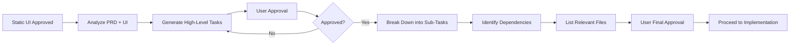
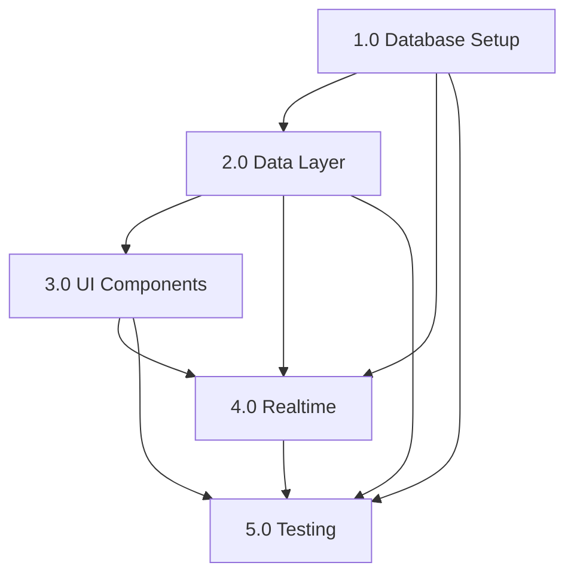

# 03 - Task Generation & Breakdown Methodology
**Version:** 1.0.0
**Last Updated:** 2025-10-10
**Purpose:** Break down approved PRDs into actionable, hierarchical tasks with clear completion criteria

---

## ⚠️ **DO NOT MODIFY THIS DOCUMENT**

**This is a REFERENCE document. Claude Code should READ and FOLLOW this document, but NEVER modify it unless the user explicitly requests an update.**

**Exception:** Only modify if the user specifically asks: "Update the Claude DOCS" or "Modify 03_TASK_GENERATION.md"

---

## 📋 OVERVIEW

After the PRD and Static UI mockup are approved, this phase breaks down the work into a structured, hierarchical task list that a junior developer could follow. Tasks are organized as parent tasks (major phases) and sub-tasks (specific actions).

**Key Principle:** Tasks should be small, specific, testable, and completable in isolation.

---

## ⚡ QUICK REFERENCE



---

## 🎯 STEP 1: ANALYZE PRD & STATIC UI

Before generating tasks, review:

### From PRD:
- [ ] All functional requirements
- [ ] User stories & acceptance criteria
- [ ] Non-functional requirements (performance, security)
- [ ] Technical considerations
- [ ] Data models
- [ ] API endpoints

### From Static UI Mockup:
- [ ] All screens/components built
- [ ] Component hierarchy
- [ ] User flows
- [ ] UI states (empty, loading, error)

### From Architecture Patterns (10_ARCHITECTURE_PATTERNS.md):
- [ ] Recommended file structure for project type
- [ ] Component organization patterns
- [ ] Separation of concerns

---

## 📝 STEP 2: GENERATE HIGH-LEVEL PARENT TASKS

Create approximately **5-10 parent tasks** representing major implementation phases.

### Parent Task Structure:
```markdown
## 1.0 [PHASE NAME]

**Objective:** [What this phase accomplishes]

**Deliverables:**
- [Concrete outputs]

**Dependencies:**
- [What must be done first]

**Estimated Complexity:** Low | Medium | High
```

### Example Parent Tasks (Leaderboard Feature):

```markdown
## 1.0 Database Schema & Backend Setup

**Objective:** Set up database tables and backend API for leaderboard data

**Deliverables:**
- Leaderboard table schema
- User stats aggregation logic
- API endpoints for fetching/updating rankings

**Dependencies:**
- None (start here)

**Estimated Complexity:** Medium

---

## 2.0 Frontend Data Layer

**Objective:** Implement state management and API integration for leaderboard data

**Deliverables:**
- API client functions
- State management setup (Zustand/TanStack Query)
- Data fetching hooks

**Dependencies:**
- 1.0 (needs API endpoints)

**Estimated Complexity:** Medium

---

## 3.0 UI Component Implementation

**Objective:** Convert static UI mockup to functional React/Svelte components

**Deliverables:**
- Leaderboard table component
- Filter/search components
- Pagination component
- Mobile card view

**Dependencies:**
- 2.0 (needs data layer)

**Estimated Complexity:** Medium

---

## 4.0 Realtime Updates

**Objective:** Implement live ranking updates using Supabase Realtime

**Deliverables:**
- Realtime subscription setup
- Optimistic UI updates
- Connection state handling

**Dependencies:**
- 1.0, 2.0, 3.0

**Estimated Complexity:** High

---

## 5.0 Testing & Polish

**Objective:** Comprehensive testing and UX improvements

**Deliverables:**
- Unit tests (80%+ coverage)
- E2E tests (Playwright)
- Loading states
- Error handling
- Accessibility fixes

**Dependencies:**
- All previous phases

**Estimated Complexity:** Medium
```

---

## ✅ APPROVAL GATE #1: High-Level Tasks

**STOP HERE and present to user:**

```markdown
I've created high-level tasks for [feature]:

1.0 [Phase 1]
2.0 [Phase 2]
3.0 [Phase 3]
...

Does this breakdown make sense? Any changes needed before I break these down into detailed sub-tasks?
```

**WAIT for user approval before proceeding to Step 3.**

---

## 🔍 STEP 3: BREAK DOWN INTO SUB-TASKS

For each approved parent task, create **3-8 specific sub-tasks**.

### Sub-Task Structure:
```markdown
### 1.1 [Specific Action]

- [ ] [Acceptance criteria 1]
- [ ] [Acceptance criteria 2]

**Files to Create/Modify:**
- `path/to/file.ts` - [Why/What]

**Testing:**
- [ ] [Test requirement]
```

### Sub-Task Rules:

1. **Actionable** - Starts with a verb (Create, Implement, Add, Update, Fix)
2. **Specific** - Clear what needs to be done
3. **Testable** - Can verify it's complete
4. **Sized Right** - 15-60 minutes of work
5. **Independent** - Can be done without waiting (unless dependency noted)

### Example Sub-Tasks (Database Schema phase):

```markdown
## 1.0 Database Schema & Backend Setup

### 1.1 Create leaderboard table migration

- [ ] Table has columns: id, user_id, rank, rating, games_played, win_rate, last_updated
- [ ] Proper indexes on user_id and rank
- [ ] Foreign key to users table
- [ ] Timestamps (created_at, updated_at)

**Files to Create/Modify:**
- `supabase/migrations/YYYYMMDD_create_leaderboard.sql` - Leaderboard table schema

**Testing:**
- [ ] Run migration on local database
- [ ] Verify table structure with `\d leaderboard`

---

### 1.2 Set up Row Level Security (RLS) policies

- [ ] Policy: Anyone can read leaderboard (public)
- [ ] Policy: Only authenticated users can update their own stats
- [ ] Policy: Service role can update any stats (for admin operations)

**Files to Create/Modify:**
- `supabase/migrations/YYYYMMDD_leaderboard_rls.sql` - RLS policies

**Testing:**
- [ ] Test read access as anonymous user
- [ ] Test write access as authenticated user
- [ ] Verify unauthorized users cannot update others' stats

---

### 1.3 Create API endpoint: GET /api/leaderboard

- [ ] Accepts query params: limit, offset, timeframe
- [ ] Returns paginated leaderboard data
- [ ] Orders by rank ascending
- [ ] Includes user profile data (username, avatar)
- [ ] Handles errors gracefully

**Files to Create/Modify:**
- `app/api/leaderboard/route.ts` - GET endpoint logic
- `lib/types/leaderboard.ts` - TypeScript types

**Testing:**
- [ ] Unit test: Returns correct data format
- [ ] Unit test: Pagination works correctly
- [ ] Unit test: Handles empty results

---

### 1.4 Create user stats aggregation function

- [ ] Function calculates: total_games, wins, losses, win_rate
- [ ] Updates leaderboard rank based on rating
- [ ] Triggers on game completion
- [ ] Handles edge cases (new users, tied ranks)

**Files to Create/Modify:**
- `supabase/functions/update-leaderboard/index.ts` - Aggregation logic
- `supabase/migrations/YYYYMMDD_leaderboard_trigger.sql` - Database trigger

**Testing:**
- [ ] Test: New game updates leaderboard
- [ ] Test: Multiple games calculate correct win rate
- [ ] Test: Tied ratings handled correctly
```

---

## 📂 STEP 4: IDENTIFY RELEVANT FILES

For each sub-task, list:

1. **Files to Create** - New files needed
2. **Files to Modify** - Existing files to update
3. **Files to Reference** - Existing code to learn from

### Format:
```markdown
**Relevant Files:**

*To Create:*
- `components/Leaderboard/LeaderboardTable.tsx` - Main table component
- `hooks/useLeaderboard.ts` - Data fetching hook
- `types/leaderboard.ts` - Type definitions

*To Modify:*
- `app/leaderboard/page.tsx` - Add new leaderboard UI
- `lib/supabase/client.ts` - Add leaderboard queries

*To Reference:*
- `components/PuzzleList/PuzzleTable.tsx` - Similar table pattern
- `hooks/usePuzzles.ts` - Similar data fetching pattern
```

---

## 🔗 STEP 5: IDENTIFY DEPENDENCIES

Mark which tasks must be completed before others can start.

### Dependency Notation:
```markdown
### 2.3 Create useLeaderboard hook

**Dependencies:** 1.3 (needs GET /api/leaderboard endpoint)

- [ ] Fetches leaderboard data from API
- [ ] Handles loading, error, and success states
- [ ] Implements pagination logic
```

### Dependency Types:
- **Hard Dependency** - Cannot start until previous task done
- **Soft Dependency** - Can start but requires mock data
- **No Dependency** - Can be done in parallel

---

## 📊 STEP 6: FINAL TASK LIST FORMAT

Present the complete task list in this format:

````markdown
# Task List: [Feature Name]

**Generated:** [Date]
**Based on:** PRD-[feature]-[date].md
**Total Tasks:** [X parent tasks, Y sub-tasks]

---

## Overview

This task list breaks down [feature] into actionable steps. Complete each sub-task in order (unless no dependency exists).

**Completion Protocol:**
- [ ] Mark sub-task complete after implementation AND tests pass
- [ ] Stop after each sub-task and ask for approval before continuing
- [ ] Update this document as new tasks are discovered

---

## Task Dependency Graph



---

## 1.0 Database Schema & Backend Setup

**Objective:** Set up database and API

**Deliverables:**
- Leaderboard table
- RLS policies
- API endpoints

**Estimated Complexity:** Medium

---

### 1.1 Create leaderboard table migration

- [ ] Table has required columns
- [ ] Proper indexes
- [ ] Foreign keys

**Files to Create:**
- `supabase/migrations/001_leaderboard.sql`

**Testing:**
- [ ] Migration runs successfully
- [ ] Table structure correct

**Dependencies:** None

---

### 1.2 Set up RLS policies

[... continue with all sub-tasks ...]

---

## 2.0 Frontend Data Layer

[... continue with all parent tasks and sub-tasks ...]

---

## Relevant Files Summary

### To Create:
1. `supabase/migrations/001_leaderboard.sql`
2. `app/api/leaderboard/route.ts`
3. `components/Leaderboard/LeaderboardTable.tsx`
[... list all new files ...]

### To Modify:
1. `app/leaderboard/page.tsx`
2. `lib/supabase/client.ts`
[... list all files to modify ...]

---

## Progress Tracking

- [ ] 1.0 Database Schema & Backend Setup (0/4 complete)
  - [ ] 1.1 Create leaderboard table
  - [ ] 1.2 Set up RLS policies
  - [ ] 1.3 Create GET endpoint
  - [ ] 1.4 Create aggregation function

- [ ] 2.0 Frontend Data Layer (0/3 complete)
  - [ ] 2.1 ...
  - [ ] 2.2 ...
  - [ ] 2.3 ...

[... track all tasks ...]

---

## Notes & Discoveries

As implementation progresses, document:
- Edge cases discovered
- Technical decisions made
- Deviations from original plan
- New tasks identified

[This section gets updated during implementation]

````

---

## ✅ APPROVAL GATE #2: Detailed Task List

**STOP HERE and present to user:**

```markdown
I've broken down each phase into specific sub-tasks:

[Show task count breakdown]
- Total: X parent tasks, Y sub-tasks
- Estimated timeline: Z hours/days

[Link to full task list document]

Does this detailed breakdown look good? Ready to proceed with implementation?
```

**WAIT for final approval before proceeding to 04_IMPLEMENTATION.md**

---

## 🧪 TASK QUALITY CHECKLIST

Before presenting task list, verify:

- [ ] Each sub-task is actionable (starts with verb)
- [ ] Each sub-task has clear acceptance criteria
- [ ] Each sub-task lists files to create/modify
- [ ] Dependencies are identified
- [ ] No sub-task is > 60 minutes of work
- [ ] Testing requirements are specified
- [ ] All PRD requirements are covered
- [ ] All UI mockup screens are covered
- [ ] Parent tasks are ordered logically
- [ ] Task count is reasonable (not overwhelming)

---

## 🎯 TASK GENERATION EXAMPLES

### Example 1: Authentication Feature

```markdown
## 1.0 Authentication Backend

### 1.1 Set up Supabase Auth
- [ ] Configure Supabase Auth settings
- [ ] Enable email/password provider
- [ ] Enable Google OAuth provider
- [ ] Configure email templates

### 1.2 Create auth API routes
- [ ] POST /api/auth/signup
- [ ] POST /api/auth/login
- [ ] POST /api/auth/logout
- [ ] POST /api/auth/reset-password

### 1.3 Implement session management
- [ ] Create auth middleware
- [ ] Handle token refresh
- [ ] Implement protected routes

## 2.0 Authentication UI

### 2.1 Create login form component
- [ ] Email/password inputs
- [ ] Form validation
- [ ] Error handling
- [ ] Loading states

### 2.2 Create signup form component
[...]
```

### Example 2: Data Export Feature

```markdown
## 1.0 Export Data Backend

### 1.1 Create export API endpoint
- [ ] GET /api/export?format=csv|json|pdf
- [ ] Query all user data
- [ ] Format data correctly
- [ ] Stream large datasets

### 1.2 Implement CSV export
- [ ] Convert data to CSV format
- [ ] Handle special characters
- [ ] Add headers row
- [ ] Test with large datasets

### 1.3 Implement PDF export
- [ ] Use Puppeteer/PDFKit
- [ ] Template design
- [ ] Page breaks
- [ ] Test with various data sizes

## 2.0 Export UI

### 2.1 Create export button component
[...]
```

---

## 🚨 COMMON MISTAKES TO AVOID

| Mistake | Problem | Solution |
|---------|---------|----------|
| Tasks too large | Takes hours to complete | Break into smaller sub-tasks (max 60 min) |
| Vague acceptance criteria | Can't verify completion | Use specific, testable criteria |
| Missing dependencies | Blocked on other work | Clearly mark dependencies |
| No file paths listed | Unclear where to work | List all files to create/modify |
| Skipping testing requirements | No test coverage | Specify tests for each sub-task |
| Too many tasks | Overwhelming | Group related work, aim for 20-50 sub-tasks |
| Missing files section | Unclear scope | Always list relevant files |

---

## 🔄 DURING IMPLEMENTATION: TASK UPDATES

As work progresses, Claude Code should:

1. **Mark completed tasks** with `[x]`
2. **Add newly discovered tasks** to appropriate sections
3. **Update file lists** if new files needed
4. **Document decisions** in Notes section
5. **Track blockers** and communicate them

Example update:
```markdown
### 1.3 Create GET endpoint ✅

- [x] Accepts query params
- [x] Returns paginated data
- [x] Orders by rank
- [x] Includes user profile data
- [x] Handles errors

**Files Created:**
- `app/api/leaderboard/route.ts`

**Notes:**
- Added caching with 60s TTL to reduce database load
- Discovered need for index on (rating, rank) - added task 1.5
```

---

## 🔗 RELATED DOCUMENTS

- [01_PRD_CREATION.md](01_PRD_CREATION.md) - Requirements foundation
- [02_STATIC_UI_MOCKUP.md](02_STATIC_UI_MOCKUP.md) - UI foundation
- [04_IMPLEMENTATION.md](04_IMPLEMENTATION.md) - Next step: implementation
- [10_ARCHITECTURE_PATTERNS.md](10_ARCHITECTURE_PATTERNS.md) - File structure reference

---

## 📊 TASK ESTIMATION GUIDE

| Complexity | Sub-Task Count | Total Time | Example |
|------------|----------------|------------|---------|
| Small | 5-15 sub-tasks | 4-8 hours | Add a filter dropdown |
| Medium | 15-30 sub-tasks | 1-3 days | Leaderboard feature |
| Large | 30-60 sub-tasks | 1-2 weeks | Full authentication system |
| Very Large | 60+ sub-tasks | 2+ weeks | Admin dashboard with analytics |

---

**After completing this step, proceed to:** `04_IMPLEMENTATION.md`
