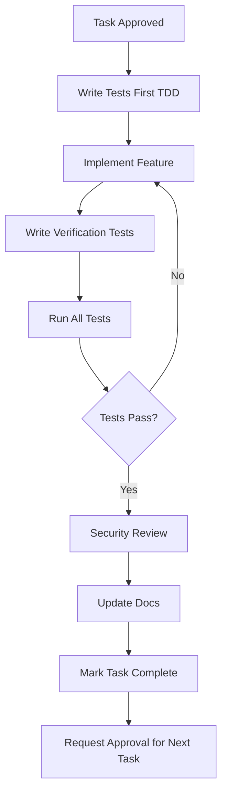

# 04 - Implementation Workflow with Test-Driven Development
**Version:** 1.0.0
**Last Updated:** 2025-10-10
**Purpose:** Implementation workflow with tests BEFORE and AFTER, comprehensive error logging, and approval gates

---

## ⚠️ **DO NOT MODIFY THIS DOCUMENT**

**This is a REFERENCE document. Exception:** Only modify if user explicitly requests.

---

## 📋 IMPLEMENTATION WORKFLOW



---

## 🎯 CORE PRINCIPLES

1. **Test-Driven Development (TDD)**
   - Write tests BEFORE implementation
   - Write verification tests AFTER implementation
   - Detailed notes on all test results

2. **One Task at a Time**
   - Complete sub-task fully before moving on
   - Stop and ask for approval after each sub-task
   - Update task list immediately

3. **Comprehensive Error Logging**
   - Log ALL errors with context
   - Use Sentry MCP for production
   - Meaningful error messages

4. **Documentation as You Go**
   - Update inline comments
   - Update workflow diagrams
   - Track decisions in task notes

---

## 📝 STEP-BY-STEP PROCESS

### 1. Start Sub-Task
```markdown
**Current Task:** 1.3 Create GET /api/leaderboard endpoint

**Before starting:**
- [ ] Read task acceptance criteria
- [ ] Review 10_ARCHITECTURE_PATTERNS.md for file structure
- [ ] Check 09_LIBRARY_REGISTRY.md for recommended libraries
- [ ] Check 08_MCP_TOOLS_REGISTRY.md for useful MCPs
```

### 2. Write Tests FIRST (TDD)

Create test file BEFORE implementation:

```typescript
// tests/unit/api/leaderboard.test.ts

import { GET } from '@/app/api/leaderboard/route';

describe('GET /api/leaderboard', () => {
  it('returns paginated leaderboard data', async () => {
    const req = new Request('http://localhost/api/leaderboard?limit=10');
    const res = await GET(req);
    const data = await res.json();

    expect(res.status).toBe(200);
    expect(data).toHaveLength(10);
    expect(data[0]).toHaveProperty('rank');
    expect(data[0]).toHaveProperty('user_id');
  });

  it('handles pagination correctly', async () => {
    const req = new Request('http://localhost/api/leaderboard?limit=5&offset=10');
    const res = await GET(req);
    const data = await res.json();

    expect(data).toHaveLength(5);
    expect(data[0].rank).toBe(11); // Starts at offset + 1
  });

  it('returns error for invalid limit', async () => {
    const req = new Request('http://localhost/api/leaderboard?limit=1000');
    const res = await GET(req);

    expect(res.status).toBe(400);
  });
});
```

**Run tests (they should FAIL):**
```bash
npm test leaderboard.test.ts
# Expected: All tests fail (endpoint doesn't exist yet)
```

### 3. Implement Feature

```typescript
// app/api/leaderboard/route.ts

/**
 * GET /api/leaderboard
 *
 * Purpose: Fetch paginated leaderboard data
 * Accepts: limit (max 100), offset (default 0)
 * Returns: Array of LeaderboardEntry
 *
 * Why separate file: Follows Next.js App Router conventions
 * Error logging: All errors logged to Sentry
 * Security: Public endpoint, rate-limited
 *
 * Last modified: 2025-10-10
 */

import { NextRequest, NextResponse } from 'next/server';
import { supabase } from '@/lib/supabase/server';
import { logger } from '@/lib/logger';
import type { LeaderboardEntry } from '@/types';

export async function GET(req: NextRequest) {
  try {
    // Parse query params
    const searchParams = req.nextUrl.searchParams;
    const limit = Math.min(parseInt(searchParams.get('limit') || '100'), 100);
    const offset = parseInt(searchParams.get('offset') || '0');

    // Validate params
    if (limit < 1 || limit > 100) {
      logger.warn('Invalid limit parameter', { limit, ip: req.ip });
      return NextResponse.json(
        { error: 'Limit must be between 1 and 100' },
        { status: 400 }
      );
    }

    // Fetch from database
    const { data, error } = await supabase
      .from('leaderboard')
      .select('*')
      .order('rank', { ascending: true })
      .range(offset, offset + limit - 1);

    if (error) {
      logger.error('Database error fetching leaderboard', {
        error: error.message,
        limit,
        offset,
      });
      throw error;
    }

    logger.info('Leaderboard fetched successfully', {
      count: data.length,
      limit,
      offset,
    });

    return NextResponse.json(data as LeaderboardEntry[]);
  } catch (error) {
    logger.error('Unexpected error in GET /api/leaderboard', {
      error: error instanceof Error ? error.message : 'Unknown error',
      stack: error instanceof Error ? error.stack : undefined,
    });

    return NextResponse.json(
      { error: 'Internal server error' },
      { status: 500 }
    );
  }
}
```

### 4. Write Verification Tests AFTER

```typescript
// tests/integration/leaderboard-flow.test.ts

describe('Leaderboard Integration Flow', () => {
  it('fetches real leaderboard data from database', async () => {
    // This test uses actual database (test environment)
    const response = await fetch('http://localhost:3000/api/leaderboard?limit=5');
    const data = await response.json();

    expect(response.ok).toBe(true);
    expect(data.length).toBeGreaterThan(0);
    expect(data[0].rank).toBe(1);
  });

  it('handles database connection failure gracefully', async () => {
    // Mock database failure
    jest.spyOn(supabase, 'from').mockImplementation(() => {
      throw new Error('Connection failed');
    });

    const response = await fetch('http://localhost:3000/api/leaderboard');

    expect(response.status).toBe(500);
    expect(await response.json()).toEqual({ error: 'Internal server error' });
  });
});
```

### 5. Run ALL Tests

```bash
# Run unit tests
npm test

# Run integration tests
npm test:integration

# Run E2E tests (if applicable)
npm test:e2e

# Generate coverage report
npm test -- --coverage
```

**Document Results:**
```markdown
## Test Results - Task 1.3

**Unit Tests:** ✅ 3/3 passed
**Integration Tests:** ✅ 2/2 passed
**Coverage:** 95% (target: 80%)

**Notes:**
- All acceptance criteria met
- Error handling verified
- Logging confirmed working
```

### 6. Security Review

Run security checklist from `05_SECURITY_CHECKLIST.md`:

```bash
# Semgrep scan
semgrep --config=p/security-audit app/api/leaderboard/

# Check for common issues
grep -r "console.log" app/api/  # Remove debug logs
```

**Document:**
```markdown
## Security Review - Task 1.3

- [x] Input validation (limit parameter)
- [x] Error handling (no stack traces exposed)
- [x] Logging (all errors logged)
- [x] No secrets in code
- [x] Rate limiting planned (task 1.5)

**Semgrep:** 0 issues
**Status:** ✅ Approved
```

### 7. Update Documentation

```typescript
// Add to README or feature doc
/**
 * API Endpoints
 *
 * GET /api/leaderboard
 * - Query params: limit (1-100), offset (0+)
 * - Returns: LeaderboardEntry[]
 * - Rate limit: 100 req/min per IP
 * - Public endpoint (no auth required)
 */
```

### 8. Mark Task Complete & Get Approval

Update task list:
```markdown
### 1.3 Create GET /api/leaderboard endpoint ✅

- [x] Accepts query params: limit, offset
- [x] Returns paginated leaderboard data
- [x] Orders by rank ascending
- [x] Handles errors gracefully
- [x] Comprehensive logging

**Files Created:**
- `app/api/leaderboard/route.ts` (85 lines)
- `tests/unit/api/leaderboard.test.ts` (45 lines)
- `tests/integration/leaderboard-flow.test.ts` (30 lines)

**Tests:** ✅ 5/5 passed (95% coverage)
**Security:** ✅ Approved
**Time:** 45 minutes

**Next Task:** 1.4 Create aggregation function
```

**Ask user:**
```
Task 1.3 completed successfully:
✅ Endpoint created with proper validation
✅ Error logging implemented
✅ 5/5 tests passing (95% coverage)
✅ Security review passed

Ready to proceed with Task 1.4 (Create aggregation function)?
```

---

## 🚨 ERROR LOGGING BEST PRACTICES

### Logger Setup

```typescript
// lib/logger.ts

/**
 * Centralized logging utility
 * Logs to console (dev) and Sentry (production)
 */

import * as Sentry from '@sentry/nextjs';

type LogLevel = 'info' | 'warn' | 'error';

interface LogContext {
  [key: string]: any;
}

export const logger = {
  info(message: string, context?: LogContext) {
    console.log(`[INFO] ${message}`, context);
    if (process.env.NODE_ENV === 'production') {
      Sentry.captureMessage(message, {
        level: 'info',
        extra: context,
      });
    }
  },

  warn(message: string, context?: LogContext) {
    console.warn(`[WARN] ${message}`, context);
    if (process.env.NODE_ENV === 'production') {
      Sentry.captureMessage(message, {
        level: 'warning',
        extra: context,
      });
    }
  },

  error(message: string, context?: LogContext) {
    console.error(`[ERROR] ${message}`, context);
    if (process.env.NODE_ENV === 'production') {
      Sentry.captureException(new Error(message), {
        extra: context,
      });
    }
  },
};
```

### What to Log

```typescript
// ✅ Good logging examples

// 1. User actions
logger.info('User logged in', { userId, email, ip });

// 2. API calls
logger.info('External API called', { service: 'Stripe', endpoint: '/charges', duration: 234 });

// 3. Errors with context
logger.error('Database query failed', {
  query: 'SELECT * FROM leaderboard',
  error: error.message,
  userId,
});

// 4. Security events
logger.warn('Failed login attempt', { email, ip, attempts: 3 });

// 5. Performance issues
logger.warn('Slow query detected', { query, duration: 5000, threshold: 1000 });
```

### What NOT to Log

```typescript
// ❌ Never log these

logger.info('User data', {
  password: user.password,  // ❌ Never log passwords
  creditCard: user.card,    // ❌ Never log payment info
  apiKey: process.env.KEY,  // ❌ Never log secrets
});
```

---

## 📊 QUALITY CHECKLIST

Before marking task complete:

- [ ] Tests written BEFORE implementation (TDD)
- [ ] Verification tests written AFTER
- [ ] All tests passing (100%)
- [ ] Code coverage ≥ 80%
- [ ] Security review completed
- [ ] Error logging implemented
- [ ] No debug console.logs remaining
- [ ] Documentation updated
- [ ] Task list updated
- [ ] User approval requested

---

## 🔗 RELATED DOCUMENTS

- [03_TASK_GENERATION.md](03_TASK_GENERATION.md) - Task breakdown
- [05_SECURITY_CHECKLIST.md](05_SECURITY_CHECKLIST.md) - Security review
- [06_TESTING_VERIFICATION.md](06_TESTING_VERIFICATION.md) - Testing details
- [10_ARCHITECTURE_PATTERNS.md](10_ARCHITECTURE_PATTERNS.md) - File organization

---

**After completing this step, proceed to:** Security review, then next task or deployment.
