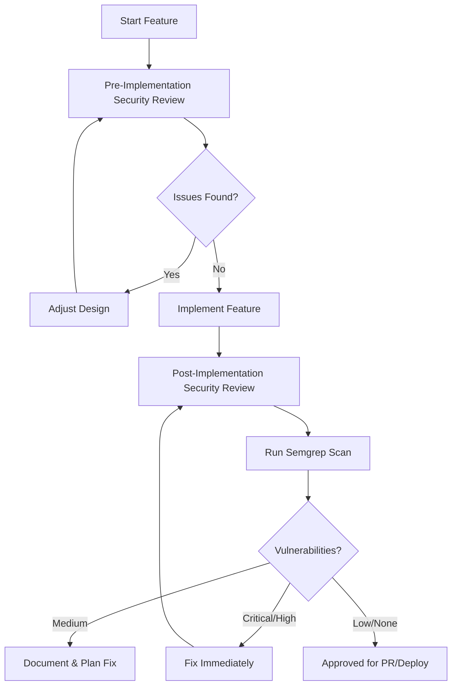

# 05 - Security Checklist & Review Process
**Version:** 1.0.0
**Last Updated:** 2025-10-10
**Purpose:** Comprehensive security review checklist based on OWASP Top 10 2021, to be performed BEFORE and AFTER every feature

---

## ⚠️ **DO NOT MODIFY THIS DOCUMENT**

**This is a REFERENCE document. Claude Code should READ and FOLLOW this document, but NEVER modify it unless the user explicitly requests an update.**

**Exception:** Only modify if the user specifically asks: "Update the Claude DOCS" or "Modify 05_SECURITY_CHECKLIST.md"

---

## 📋 OVERVIEW

**Security is NON-NEGOTIABLE.** This checklist must be completed:
1. **BEFORE** starting implementation (design review)
2. **AFTER** completing implementation (code review)
3. **BEFORE** creating a pull request
4. **BEFORE** deploying to production

**Tool:** Use **Semgrep MCP** for automated security scanning at each checkpoint.

---

## ⚡ SECURITY WORKFLOW



---

## 🔴 OWASP TOP 10 2021 CHECKLIST

### A01:2021 - Broken Access Control

**Risk:** Users access data/functions they shouldn't.

#### Pre-Implementation Checklist:
- [ ] Define who can access what (access control matrix)
- [ ] Identify all protected resources (APIs, pages, data)
- [ ] Plan authentication checks for all endpoints
- [ ] Plan authorization checks (role/permission-based)
- [ ] Consider principle of least privilege

#### Post-Implementation Checklist:
- [ ] All API endpoints have authentication checks
- [ ] All API endpoints have authorization checks (not just authentication)
- [ ] Users cannot access other users' data
- [ ] Admin functions are restricted to admin role
- [ ] No sensitive data exposed in URLs (use POST, not GET)
- [ ] CORS configured correctly (not allowing `*` in production)
- [ ] Rate limiting on sensitive endpoints

#### Code Examples:

**❌ BAD - No Authorization:**
```typescript
// api/user/[id]/route.ts
export async function GET(req: Request, { params }: { params: { id: string } }) {
  // No check if user can access this data!
  const user = await db.user.findUnique({ where: { id: params.id } });
  return Response.json(user);
}
```

**✅ GOOD - Proper Authorization:**
```typescript
// api/user/[id]/route.ts
export async function GET(req: Request, { params }: { params: { id: string } }) {
  const session = await getSession(req);

  // Authentication check
  if (!session) {
    return Response.json({ error: 'Unauthorized' }, { status: 401 });
  }

  // Authorization check - users can only access their own data (or admins can access all)
  if (session.userId !== params.id && session.role !== 'admin') {
    return Response.json({ error: 'Forbidden' }, { status: 403 });
  }

  const user = await db.user.findUnique({ where: { id: params.id } });
  return Response.json(user);
}
```

#### Semgrep Rules to Check:
```yaml
# Run: semgrep --config=p/owasp-top-ten
```

---

### A02:2021 - Cryptographic Failures

**Risk:** Sensitive data exposed due to weak/missing encryption.

#### Pre-Implementation Checklist:
- [ ] Identify all sensitive data (passwords, tokens, PII, payment info)
- [ ] Plan encryption at rest (database encryption)
- [ ] Plan encryption in transit (HTTPS everywhere)
- [ ] Never log sensitive data
- [ ] Use environment variables for secrets

#### Post-Implementation Checklist:
- [ ] All passwords hashed with bcrypt/argon2 (NOT MD5/SHA1)
- [ ] API keys stored in environment variables (NOT in code)
- [ ] HTTPS enforced (no HTTP in production)
- [ ] Sensitive data NOT in localStorage (use httpOnly cookies)
- [ ] Database connections use SSL/TLS
- [ ] No secrets committed to git (check `.env` in `.gitignore`)
- [ ] Session tokens are random, long, and expire

#### Code Examples:

**❌ BAD - Plaintext Passwords:**
```typescript
// NEVER DO THIS
await db.user.create({
  data: {
    email: email,
    password: password, // ❌ Stored in plaintext!
  },
});
```

**✅ GOOD - Hashed Passwords:**
```typescript
import bcrypt from 'bcrypt';

const hashedPassword = await bcrypt.hash(password, 10);
await db.user.create({
  data: {
    email: email,
    password: hashedPassword, // ✅ Hashed
  },
});
```

**❌ BAD - Secrets in Code:**
```typescript
// ❌ NEVER DO THIS
const apiKey = 'sk_live_abc123xyz';
```

**✅ GOOD - Secrets in Environment:**
```typescript
// ✅ Use environment variables
const apiKey = process.env.STRIPE_SECRET_KEY;
if (!apiKey) throw new Error('STRIPE_SECRET_KEY not set');
```

#### Check with grep:
```bash
# Search for potential secrets in code
grep -r "api_key\|password\|secret" --exclude-dir=node_modules .
```

---

### A03:2021 - Injection

**Risk:** SQL injection, command injection, XSS, etc.

#### Pre-Implementation Checklist:
- [ ] Plan to use parameterized queries (ORMs like Prisma/SQLModel)
- [ ] Plan input validation for all user inputs
- [ ] Plan output escaping for all user-generated content

#### Post-Implementation Checklist:
- [ ] No raw SQL queries with string concatenation
- [ ] All user inputs validated and sanitized
- [ ] ORM used (Prisma, Drizzle, SQLAlchemy) with parameterized queries
- [ ] No `dangerouslySetInnerHTML` with user content
- [ ] No `eval()` or `Function()` with user input
- [ ] Command-line execution avoided (or properly escaped)
- [ ] XSS protection enabled (Content-Security-Policy headers)

#### Code Examples:

**❌ BAD - SQL Injection:**
```typescript
// ❌ NEVER DO THIS
const query = `SELECT * FROM users WHERE email = '${userEmail}'`;
await db.execute(query);
```

**✅ GOOD - Parameterized Query:**
```typescript
// ✅ Use ORM or parameterized queries
const user = await db.user.findUnique({
  where: { email: userEmail },
});
```

**❌ BAD - XSS Vulnerability:**
```typescript
// ❌ Renders user HTML directly
<div dangerouslySetInnerHTML={{ __html: userComment }} />
```

**✅ GOOD - Escaped Output:**
```typescript
// ✅ React escapes by default
<div>{userComment}</div>

// Or use sanitization library
import DOMPurify from 'dompurify';
<div dangerouslySetInnerHTML={{ __html: DOMPurify.sanitize(userComment) }} />
```

#### Semgrep Check:
```bash
semgrep --config=p/sql-injection .
semgrep --config=p/xss .
```

---

### A04:2021 - Insecure Design

**Risk:** Fundamental security flaws in architecture.

#### Pre-Implementation Checklist:
- [ ] Threat model created (what could go wrong?)
- [ ] Secure design patterns identified
- [ ] Defense in depth (multiple layers of security)
- [ ] Fail securely (errors don't expose info)

#### Post-Implementation Checklist:
- [ ] Security requirements from PRD implemented
- [ ] No security through obscurity
- [ ] Proper separation of concerns
- [ ] Critical operations require re-authentication
- [ ] Business logic validated server-side (not just client-side)

---

### A05:2021 - Security Misconfiguration

**Risk:** Defaults, incomplete setups, exposed errors.

#### Pre-Implementation Checklist:
- [ ] Security headers planned (CSP, HSTS, X-Frame-Options)
- [ ] Error handling planned (don't expose stack traces)
- [ ] Dependency management planned (keep updated)

#### Post-Implementation Checklist:
- [ ] All security headers configured:
  - `Content-Security-Policy`
  - `X-Frame-Options: DENY`
  - `X-Content-Type-Options: nosniff`
  - `Strict-Transport-Security` (HSTS)
  - `Referrer-Policy: strict-origin-when-cross-origin`
- [ ] Default accounts/passwords changed
- [ ] Stack traces NOT exposed in production
- [ ] Detailed errors logged server-side, generic errors shown to users
- [ ] Dependencies up to date (`npm audit`, `pip-audit`)
- [ ] Unnecessary features/endpoints removed
- [ ] CORS properly configured (not `*`)

#### Code Examples (Next.js):

```typescript
// next.config.js
const securityHeaders = [
  {
    key: 'X-Frame-Options',
    value: 'DENY',
  },
  {
    key: 'X-Content-Type-Options',
    value: 'nosniff',
  },
  {
    key: 'Referrer-Policy',
    value: 'strict-origin-when-cross-origin',
  },
  {
    key: 'Content-Security-Policy',
    value: "default-src 'self'; script-src 'self' 'unsafe-inline'; style-src 'self' 'unsafe-inline';",
  },
];

module.exports = {
  async headers() {
    return [
      {
        source: '/(.*)',
        headers: securityHeaders,
      },
    ];
  },
};
```

**Error Handling:**
```typescript
// ❌ BAD - Exposes stack trace
catch (error) {
  return Response.json({ error: error.stack }, { status: 500 });
}

// ✅ GOOD - Generic error + server-side logging
catch (error) {
  console.error('[API Error]', error); // Log server-side
  return Response.json({ error: 'Internal server error' }, { status: 500 });
}
```

---

### A06:2021 - Vulnerable and Outdated Components

**Risk:** Using libraries with known vulnerabilities.

#### Pre-Implementation Checklist:
- [ ] Check `09_LIBRARY_REGISTRY.md` for recommended libraries
- [ ] Use Perplexity MCP to verify library is maintained
- [ ] Check npm/PyPI for last update date

#### Post-Implementation Checklist:
- [ ] No deprecated libraries used
- [ ] All dependencies are latest stable versions
- [ ] `npm audit` shows no high/critical vulnerabilities
- [ ] `pip-audit` shows no high/critical vulnerabilities (Python)
- [ ] Automated dependency updates configured (Dependabot/Renovate)
- [ ] Unused dependencies removed

#### Commands:
```bash
# JavaScript/TypeScript
npm audit
npm audit fix
npm outdated

# Python
pip-audit
pip list --outdated
safety check
```

---

### A07:2021 - Identification and Authentication Failures

**Risk:** Broken auth allows attackers to compromise accounts.

#### Pre-Implementation Checklist:
- [ ] Auth provider chosen (Supabase Auth, NextAuth.js, etc.)
- [ ] Multi-factor authentication planned (if applicable)
- [ ] Password policies defined
- [ ] Session management planned

#### Post-Implementation Checklist:
- [ ] Passwords have minimum length (12+ chars)
- [ ] Account enumeration prevented (same error for "user doesn't exist" and "wrong password")
- [ ] Brute force protection (rate limiting on login)
- [ ] Session tokens are secure (httpOnly, secure, sameSite)
- [ ] Logout functionality works correctly (invalidates session)
- [ ] Password reset is secure (time-limited tokens, sent via email)
- [ ] No weak passwords allowed (check against common password lists)
- [ ] MFA implemented for sensitive operations

#### Code Examples:

**Session Cookie Configuration:**
```typescript
// ✅ Secure session cookie
const cookie = serialize('session', token, {
  httpOnly: true,    // Not accessible via JavaScript
  secure: true,      // HTTPS only
  sameSite: 'lax',   // CSRF protection
  maxAge: 60 * 60 * 24 * 7, // 1 week
  path: '/',
});
```

**Rate Limiting (using Upstash Redis):**
```typescript
import { Ratelimit } from '@upstash/ratelimit';
import { Redis } from '@upstash/redis';

const ratelimit = new Ratelimit({
  redis: Redis.fromEnv(),
  limiter: Ratelimit.slidingWindow(5, '1 m'), // 5 attempts per minute
});

export async function POST(req: Request) {
  const ip = req.headers.get('x-forwarded-for') ?? 'anonymous';
  const { success } = await ratelimit.limit(ip);

  if (!success) {
    return Response.json({ error: 'Too many attempts' }, { status: 429 });
  }

  // Proceed with login
}
```

---

### A08:2021 - Software and Data Integrity Failures

**Risk:** Insecure CI/CD, untrusted dependencies, auto-updates.

#### Pre-Implementation Checklist:
- [ ] Dependencies from trusted sources only (npm, PyPI)
- [ ] Code review process planned
- [ ] CI/CD pipeline secured

#### Post-Implementation Checklist:
- [ ] All dependencies verified (checksums, signatures)
- [ ] CI/CD uses secrets management (not hardcoded)
- [ ] Unsigned/unverified code not deployed
- [ ] Dependency lock files committed (`package-lock.json`, `poetry.lock`)
- [ ] Subresource Integrity (SRI) for CDN resources

#### Example (SRI for CDN):
```html
<!-- ✅ With integrity hash -->
<script
  src="https://cdn.tailwindcss.com"
  integrity="sha384-..."
  crossorigin="anonymous"
></script>
```

---

### A09:2021 - Security Logging and Monitoring Failures

**Risk:** Breaches go undetected, incidents can't be investigated.

#### Pre-Implementation Checklist:
- [ ] Logging strategy defined (what to log)
- [ ] Monitoring tool chosen (Sentry MCP for production)
- [ ] Alert thresholds defined

#### Post-Implementation Checklist:
- [ ] All authentication attempts logged (success & failure)
- [ ] All authorization failures logged
- [ ] Input validation failures logged
- [ ] Server errors logged with context
- [ ] Sensitive data NOT logged (passwords, tokens)
- [ ] Logs sent to centralized system (Sentry, Datadog, CloudWatch)
- [ ] Alerts configured for suspicious activity
- [ ] Log retention policy defined

#### Code Examples:

```typescript
// ✅ Good logging
import { logger } from '@/lib/logger';

try {
  await db.user.create({ data: userData });
  logger.info('User created', { userId, email, ip: req.ip });
} catch (error) {
  logger.error('User creation failed', {
    error: error.message,
    userId,
    email,
    stack: error.stack,
  });
  throw error;
}

// Authentication failure
logger.warn('Login attempt failed', {
  email,
  ip: req.ip,
  userAgent: req.headers.get('user-agent'),
});
```

**Sentry Integration:**
```typescript
import * as Sentry from '@sentry/nextjs';

Sentry.init({
  dsn: process.env.SENTRY_DSN,
  environment: process.env.NODE_ENV,
  tracesSampleRate: 1.0,
});

// Usage
try {
  // ...
} catch (error) {
  Sentry.captureException(error, {
    tags: { feature: 'leaderboard' },
    extra: { userId, context },
  });
}
```

---

### A10:2021 - Server-Side Request Forgery (SSRF)

**Risk:** Attacker makes server fetch internal/malicious URLs.

#### Pre-Implementation Checklist:
- [ ] Identify any features that fetch external URLs
- [ ] Plan URL validation and allowlisting

#### Post-Implementation Checklist:
- [ ] User-provided URLs validated (allowlist approach)
- [ ] No fetching of internal/localhost URLs
- [ ] URL parsing done safely
- [ ] Timeouts on external requests

#### Code Examples:

**❌ BAD - Unsafe URL Fetch:**
```typescript
// ❌ User can provide any URL
export async function POST(req: Request) {
  const { url } = await req.json();
  const response = await fetch(url); // SSRF vulnerability!
  return Response.json(await response.json());
}
```

**✅ GOOD - Validated URL Fetch:**
```typescript
// ✅ Validate and allowlist
const ALLOWED_DOMAINS = ['api.github.com', 'api.openai.com'];

export async function POST(req: Request) {
  const { url } = await req.json();

  // Parse and validate
  let parsedUrl;
  try {
    parsedUrl = new URL(url);
  } catch {
    return Response.json({ error: 'Invalid URL' }, { status: 400 });
  }

  // Check allowlist
  if (!ALLOWED_DOMAINS.includes(parsedUrl.hostname)) {
    return Response.json({ error: 'Domain not allowed' }, { status: 403 });
  }

  // Prevent internal URLs
  if (parsedUrl.hostname === 'localhost' || parsedUrl.hostname === '127.0.0.1') {
    return Response.json({ error: 'Internal URLs not allowed' }, { status: 403 });
  }

  const response = await fetch(url, { timeout: 5000 });
  return Response.json(await response.json());
}
```

---

## 🛡️ ADDITIONAL SECURITY BEST PRACTICES

### Database Security (Supabase/Postgres)

- [ ] Row Level Security (RLS) enabled on all tables
- [ ] Service role key never exposed to client
- [ ] Database backups configured
- [ ] Least privilege principle for database users

**Example RLS Policy:**
```sql
-- Users can only read their own data
CREATE POLICY "Users can read own data"
ON users FOR SELECT
USING (auth.uid() = id);

-- Users can only update their own profile
CREATE POLICY "Users can update own profile"
ON users FOR UPDATE
USING (auth.uid() = id);
```

### API Security

- [ ] Rate limiting on all endpoints (especially auth, search, expensive operations)
- [ ] Input validation on all parameters
- [ ] Pagination enforced (max limit)
- [ ] API keys rotated regularly

### Frontend Security

- [ ] No sensitive logic in client-side code
- [ ] No API keys in client-side code
- [ ] Content Security Policy configured
- [ ] Third-party scripts minimized

### Mobile/Desktop App Security

- [ ] API keys stored securely (Keychain/Keystore)
- [ ] Certificate pinning for API calls (if applicable)
- [ ] Obfuscation for sensitive code (if necessary)

---

## 🔍 AUTOMATED SECURITY SCANNING

### Using Semgrep MCP

**When to run:**
- Before starting implementation (baseline)
- After each major change
- Before creating PR
- Before deployment

**Command:**
```bash
# Full OWASP scan
semgrep --config=p/owasp-top-ten .

# Specific checks
semgrep --config=p/security-audit .
semgrep --config=p/sql-injection .
semgrep --config=p/xss .
```

**Interpreting Results:**
- **Critical/High:** Must fix before deployment
- **Medium:** Fix within 1 week or document as accepted risk
- **Low/Info:** Fix when convenient

---

## 📋 SECURITY REVIEW TEMPLATE

Use this template for each feature:

```markdown
# Security Review: [Feature Name]

**Date:** [Date]
**Reviewer:** Claude Code
**Phase:** Pre-Implementation / Post-Implementation

## OWASP Top 10 Review

### A01 - Access Control
- [ ] Authentication checks: ...
- [ ] Authorization checks: ...
- [ ] Issues found: None / [List issues]

### A02 - Cryptographic Failures
- [ ] Sensitive data identified: ...
- [ ] Encryption plan: ...
- [ ] Issues found: None / [List issues]

[... continue for all 10 ...]

## Semgrep Scan Results
- **Critical:** 0
- **High:** 0
- **Medium:** 2 (documented below)
- **Low:** 5

**Medium Issues:**
1. [Description] - Accepted risk because...
2. [Description] - Fix planned for...

## Recommendation
✅ Approved for implementation / PR / deployment
❌ Blocked - critical issues must be resolved

**Signed:** Claude Code
**Date:** [Date]
```

---

## 🚨 SECURITY INCIDENT RESPONSE

If a vulnerability is discovered:

1. **Assess severity** (Critical/High/Medium/Low)
2. **If Critical/High:**
   - Stop deployment immediately
   - Fix vulnerability
   - Re-run security scan
   - Document in Linear MCP
3. **If Medium:**
   - Document issue
   - Plan fix within 1 week
   - Create Linear issue
4. **If Low:**
   - Document issue
   - Add to backlog

---

## 🔗 RELATED DOCUMENTS

- [MASTER_WORKFLOW.md](MASTER_WORKFLOW.md) - Overall workflow
- [04_IMPLEMENTATION.md](04_IMPLEMENTATION.md) - Implementation must follow security guidelines
- [08_MCP_TOOLS_REGISTRY.md](08_MCP_TOOLS_REGISTRY.md) - Semgrep MCP usage

---

## 📚 EXTERNAL RESOURCES

- **OWASP Top 10:** https://owasp.org/www-project-top-ten/
- **OWASP Cheat Sheets:** https://cheatsheetseries.owasp.org/
- **Semgrep Rules:** https://semgrep.dev/explore
- **Snyk Vulnerability DB:** https://security.snyk.io/

---

**Remember:** Security is not optional. Every feature must pass security review before deployment!
