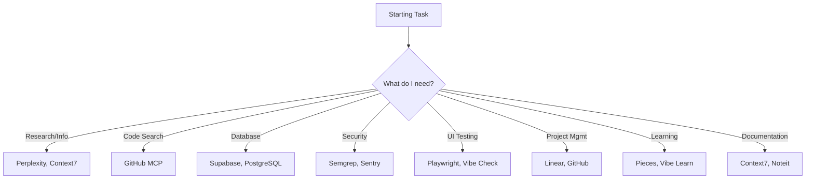
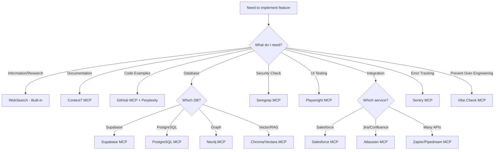

# 08 - MCP Tools Registry
**Version:** 1.0.0
**Last Updated:** 2025-10-10
**Purpose:** Comprehensive catalog of available MCP servers, their capabilities, and when to use them

---

## ⚠️ **DO NOT MODIFY THIS DOCUMENT**

**This is a REFERENCE document. Claude Code should READ and FOLLOW this document, but NEVER modify it unless the user explicitly requests an update.**

**Exception:** Only modify if the user specifically asks: "Update the Claude DOCS" or "Modify 08_MCP_TOOLS_REGISTRY.md"

**Note:** This registry should be consulted BEFORE implementing any feature. Always check if an MCP can help!

---

## 📋 QUICK REFERENCE: When to Use MCPs



---

## 🎯 CURRENTLY INSTALLED MCPs (TacticsQuest Reference)

### 1. Linear MCP
**Type:** Project Management / Issue Tracking
**URL:** https://mcp.linear.app/mcp
**Status:** ✅ Active

**Capabilities:**
- Create, read, update issues/tasks
- Track project progress
- Link code changes to issues
- View team workflow

**When to Use:**
```
✅ Troubleshooting & bug tracking
✅ Referencing issue history
✅ Creating debug branches for specific issues
✅ Documenting problems during development
```

**Example Usage:**
```typescript
// When encountering a bug during development:
// 1. Use Linear MCP to create an issue with details
// 2. Use Linear MCP to search for similar past issues
// 3. Link your fix branch to the Linear issue
```

**Configuration:**
```json
{
  "mcpServers": {
    "linear": {
      "type": "http",
      "url": "https://mcp.linear.app/mcp"
    }
  }
}
```

---

## 🔧 RECOMMENDED MCPs TO INSTALL

### Research & Documentation

#### 2. WebSearch (Built-in)
**Type:** Web Search / Research
**Status:** ✅ Active (Built-in, FREE)

**Capabilities:**
- Real-time web search
- Find best practices
- Discover latest documentation
- Compare technologies
- Verify library currency
- Research current trends

**When to Use:**
```
✅ Before choosing a tech stack
✅ Researching unfamiliar technologies
✅ Finding solutions to complex problems
✅ Verifying library is still maintained
✅ Getting current best practices (2025)
✅ Checking for library updates
```

**Example Prompts:**
```
"What's the best way to implement OAuth2 with Supabase in 2025?"
"Compare Next.js vs SvelteKit for a chess game with realtime features"
"Is library X still actively maintained? What are alternatives?"
"Latest Tailwind CSS best practices 2025"
```

**Setup:**
```bash
# No setup needed - built into Claude Code!
# Just use it in your prompts
```

---

#### 3. Context7 MCP
**Type:** Up-to-Date Documentation Provider
**Status:** 🟡 Recommended (Not Yet Installed)

**Capabilities:**
- Always current documentation
- Best practices for frameworks
- API reference for libraries
- Framework-specific guides

**When to Use:**
```
✅ Getting docs for current build tools
✅ Learning new framework APIs
✅ Verifying correct usage of libraries
✅ Finding framework best practices
```

**Example Prompts:**
```
"Get latest Next.js 15 documentation on Server Components"
"Show me Tailwind CSS best practices for responsive design"
"What's the current FastAPI authentication pattern?"
```

---

### Development & Code Quality

#### 4. GitHub MCP
**Type:** Repository Management
**Status:** 🟡 Recommended (Not Yet Installed)

**Capabilities:**
- Create/manage repositories
- Create pull requests
- Review code
- Manage issues
- Create releases
- Access repository data

**When to Use:**
```
✅ Creating repos for new projects
✅ Managing PRs programmatically
✅ Automating release processes
✅ Searching code across repos
✅ Creating debug branches
```

**Example Usage:**
```typescript
// Create a new repo
// Create a PR with auto-generated description
// Search for code patterns across repos
// Link commits to issues
```

---

#### 5. Semgrep MCP
**Type:** Security Analysis / Code Scanning
**Status:** 🟡 Recommended (High Priority)

**Capabilities:**
- Automated security checks
- Vulnerability detection
- Code quality analysis
- Custom rule enforcement
- OWASP compliance checking

**When to Use:**
```
✅ BEFORE every commit (pre-commit hook)
✅ BEFORE creating a PR
✅ During security review phase
✅ After adding new dependencies
✅ Monthly comprehensive scans
```

**Example Workflow:**
```bash
# Run semgrep scan
# Review vulnerabilities report
# Fix critical/high issues
# Verify fixes with re-scan
# Document findings
```

**Integration:**
```yaml
# .semgrep.yml example
rules:
  - id: check-sql-injection
    pattern: execute($SQL)
    message: Potential SQL injection
    severity: ERROR
```

---

#### 6. Vibe Check MCP
**Type:** Chain-Pattern Interrupt / Over-Engineering Prevention
**Status:** 🟡 Recommended

**Capabilities:**
- Challenge assumptions during development
- Prevent tunnel vision
- Capture mistakes & successes
- Set/merge session rules
- Enforce best practices

**When to Use:**
```
✅ When implementing complex features
✅ Before adding new dependencies
✅ When code feels overly complicated
✅ After making architectural decisions
✅ During code reviews
```

**Commands:**
1. `VIBE_CHECK` - Challenge current approach
2. `vibe_learn` - Capture lessons learned
3. `update_constitution` - Set session rules
4. `reset_constitution` - Clear session rules
5. `check_constitution` - Review active rules

**Example Usage:**
```
Before: "I need to add Redis, RabbitMQ, and Kubernetes for this simple form"
After VIBE_CHECK: "Actually, just use Supabase realtime for this use case"
```

---

### Database & Backend

#### 7. Supabase MCP
**Type:** Database Management / Auth / Storage
**Status:** 🟡 Recommended (High Priority)

**Capabilities:**
- Query Postgres database
- Manage auth users
- Handle file storage
- View version history
- Manage realtime subscriptions
- Execute migrations

**When to Use:**
```
✅ Querying data during development
✅ Managing user accounts
✅ Debugging auth issues
✅ Viewing database schema
✅ Testing queries before implementation
```

**Example Usage:**
```sql
-- Query leaderboard data via MCP
SELECT * FROM leaderboard ORDER BY rating DESC LIMIT 10;

-- Check auth users
SELECT email, created_at FROM auth.users WHERE email LIKE '%test%';

-- View storage buckets
SELECT * FROM storage.buckets;
```

---

#### 8. PostgreSQL MCP
**Type:** Direct Database Access
**Status:** 🟡 Recommended

**Capabilities:**
- Read-only queries (safe)
- Schema inspection
- Query optimization
- Data analysis

**When to Use:**
```
✅ Inspecting database schema
✅ Running complex analytical queries
✅ Debugging data issues
✅ Verifying indexes/constraints
```

---

### Testing & Quality Assurance

#### 9. Playwright MCP
**Type:** Browser Automation / UI Testing
**Status:** 🟡 Recommended (High Priority)

**Capabilities:**
- Take screenshots of UI
- Run automated UI tests
- Compare against style guides
- Grade UI objectively (1-10 scale)
- Verify responsive behavior

**When to Use:**
```
✅ After building static UI mockup
✅ Verifying UI matches design specs
✅ Testing across different viewports
✅ Visual regression testing
✅ Automated E2E testing
```

**Workflow (from MCPs.txt):**
```
1. Screenshot the current UI
2. Reference /style-guide/style-guide.md and /style-guide/ux-rules.md
3. Grade output objectively (1-10 scale)
4. For scores < 8/10, make changes
5. Repeat until all screens score 8+
```

**Example:**
```typescript
// playwright.config.ts
export default {
  testDir: './tests',
  use: {
    screenshot: 'on',
    video: 'retain-on-failure',
  },
  projects: [
    { name: 'Desktop Chrome', use: { viewport: { width: 1280, height: 720 } } },
    { name: 'Mobile Safari', use: { viewport: { width: 375, height: 667 } } },
  ],
};
```

---

### Debugging & Monitoring

#### 10. Sentry MCP
**Type:** Error Tracking / Debugging
**Status:** 🟡 Recommended

**Capabilities:**
- Real-time error tracking
- Stack trace analysis
- Performance monitoring
- Release tracking
- User impact analysis

**When to Use:**
```
✅ Monitoring production errors
✅ Debugging hard-to-reproduce issues
✅ Tracking error frequency
✅ Performance profiling
✅ Release health monitoring
```

**Setup:**
```typescript
// Example Sentry integration
import * as Sentry from "@sentry/nextjs";

Sentry.init({
  dsn: process.env.NEXT_PUBLIC_SENTRY_DSN,
  tracesSampleRate: 1.0,
  environment: process.env.NODE_ENV,
});
```

---

### Memory & Learning

#### 11. Pieces MCP
**Type:** Local Memory / Issue Context
**Status:** 🟡 Recommended

**Capabilities:**
- Form memories about issues
- Locally processed (privacy)
- Integrate with current project
- Remember preferences & patterns

**When to Use:**
```
✅ Configuring project-specific settings
✅ Remembering recurring issues
✅ Storing project context
✅ Learning user preferences
```

---

### Note-Taking & Documentation

#### 12. Noteit MCP
**Type:** Note Creation
**Status:** 🟡 Recommended

**Capabilities:**
- Create structured notes
- Document decisions
- Track TODOs
- Archive learnings

**When to Use:**
```
✅ Documenting architectural decisions
✅ Creating meeting notes
✅ Tracking technical debt
✅ Recording debugging sessions
```

---

## 🌐 ENTERPRISE & CLOUD MCPs

### 13. Salesforce MCP
**Type:** CRM Integration
**Use Case:** Building apps that integrate with Salesforce

---

### 14. Zapier MCP
**Type:** Automation / Integration
**Capabilities:** Connect to 7,000+ apps via natural language

**When to Use:**
```
✅ Automating workflows between services
✅ Triggering actions from events
✅ Integrating third-party services
```

---

### 15. K2view MCP
**Type:** Enterprise Data Access
**Use Case:** Accessing unified business data for AI

---

### 16. Notion MCP
**Type:** Workspace Data
**Use Case:** Accessing/updating Notion databases & pages

---

### 17. Atlassian MCP
**Type:** Jira/Confluence Integration
**Use Case:** Working with Jira issues or Confluence docs

---

## 🎨 DESIGN & UI

### 18. Mobin.com
**Type:** App UI Design
**Status:** 🟡 Tool (Not MCP)

**When to Use:**
```
✅ Designing app UI mockups
✅ Creating design prototypes
✅ UI inspiration
```

---

## 🧠 SPECIALIZED MCPs

### 19. Chroma MCP
**Type:** Vector Database / Semantic Search
**Use Case:** RAG applications, semantic document search

---

### 20. Vectara MCP
**Type:** Commercial Semantic Search
**Use Case:** Semantic search & retrieval-augmented generation

---

### 21. Astra DB MCP
**Type:** NoSQL Database
**Use Case:** DataStax Astra DB management

---

### 22. Neo4j GDS MCP
**Type:** Graph Database
**Use Case:** Graph data science & algorithms

---

### 23. Pipedream MCP
**Type:** API Integration
**Use Case:** Connect to 2,500+ APIs with prebuilt tools

---

### 24. Perplexity Sonar API MCP
**Type:** Real-time Research
**Use Case:** Web-wide research for conversational AI

---

## 📊 MCP PRIORITY MATRIX

| Priority | MCP | Reason | Install When |
|----------|-----|--------|--------------|
| 🔴 Critical | Semgrep | Security is mandatory | Immediately |
| 🔴 Critical | WebSearch | Research is essential (built-in, FREE) | Already available! |
| 🔴 Critical | Supabase | Database is core to most projects | If using Supabase |
| 🟠 High | Context7 | Up-to-date docs critical | Starting any new project |
| 🟠 High | Playwright | UI testing is required | Building web UIs |
| 🟡 Medium | GitHub | Useful for repo management | Working with GitHub |
| 🟡 Medium | Sentry | Production monitoring | Before deploying |
| 🟡 Medium | Vibe Check | Prevents over-engineering | Complex projects |
| 🟢 Low | Pieces | Nice to have | If memory issues occur |
| 🟢 Low | Noteit | Nice to have | Heavy documentation needs |

---

## 🔍 MCP DECISION FLOWCHART



---

## 🛠️ HOW TO INSTALL NEW MCPs

### Method 1: Via Claude Code CLI
```bash
claude mcp:add <mcp-name>
```

### Method 2: Manual Configuration
```json
// .mcp.json in project root
{
  "mcpServers": {
    "linear": {
      "type": "http",
      "url": "https://mcp.linear.app/mcp"
    },
    "perplexity": {
      "type": "http",
      "url": "https://api.perplexity.ai/mcp",
      "auth": {
        "type": "bearer",
        "token": "${PERPLEXITY_API_KEY}"
      }
    }
  }
}
```

### Method 3: From MCP Registry
```bash
# Visit https://mcpservers.org/
# Search for desired MCP
# Follow installation instructions
```

---

## 📚 MCP USAGE EXAMPLES

### Example 1: Starting a New Feature

```markdown
**Task:** Build user authentication system

**MCP Usage:**
1. **Perplexity MCP:** "What's the best authentication pattern for Next.js + Supabase in 2025?"
2. **Context7 MCP:** "Get Supabase Auth documentation"
3. **GitHub MCP:** Search existing auth implementations in similar projects
4. **Vibe Check:** Challenge assumption that custom auth is needed (maybe Supabase Auth is enough?)
5. **Semgrep MCP:** Scan auth code for security issues
6. **Playwright MCP:** Test auth flows (login, signup, password reset)
```

### Example 2: Debugging Production Issue

```markdown
**Task:** Fix leaderboard not updating

**MCP Usage:**
1. **Sentry MCP:** Check error logs for leaderboard-related errors
2. **Linear MCP:** Search for similar past issues
3. **Supabase MCP:** Query leaderboard table to verify data
4. **GitHub MCP:** Search code for leaderboard update logic
5. **Perplexity MCP:** Research Supabase realtime best practices
```

### Example 3: Security Review

```markdown
**Task:** Pre-deployment security check

**MCP Usage:**
1. **Semgrep MCP:** Run comprehensive security scan
2. **Supabase MCP:** Verify RLS policies on all tables
3. **GitHub MCP:** Check for secrets in commit history
4. **Vibe Check:** Verify security measures aren't over-engineered for use case
```

---

## 🚀 NEXT STEPS

1. Review this registry before starting ANY new task
2. Install critical MCPs (Semgrep, Perplexity, Context7)
3. Configure MCPs in your project's `.mcp.json`
4. Refer to this doc when stuck or researching
5. Update this registry when discovering new useful MCPs

---

## 🔗 RELATED DOCUMENTS

- [MASTER_WORKFLOW.md](MASTER_WORKFLOW.md) - Main workflow reference
- [09_LIBRARY_REGISTRY.md](09_LIBRARY_REGISTRY.md) - Library tracking
- [05_SECURITY_CHECKLIST.md](05_SECURITY_CHECKLIST.md) - Security review process

---

## 📝 EXTERNAL RESOURCES

- **Official MCP Directory:** https://mcpservers.org/
- **Awesome MCP Servers:** https://github.com/wong2/awesome-mcp-servers
- **MCP Specification:** https://modelcontextprotocol.io/
- **Claude Code MCP Docs:** https://docs.claude.com/en/docs/claude-code/mcp

---

**Remember:** Always check this registry BEFORE implementing a feature. An MCP might already solve your problem!
