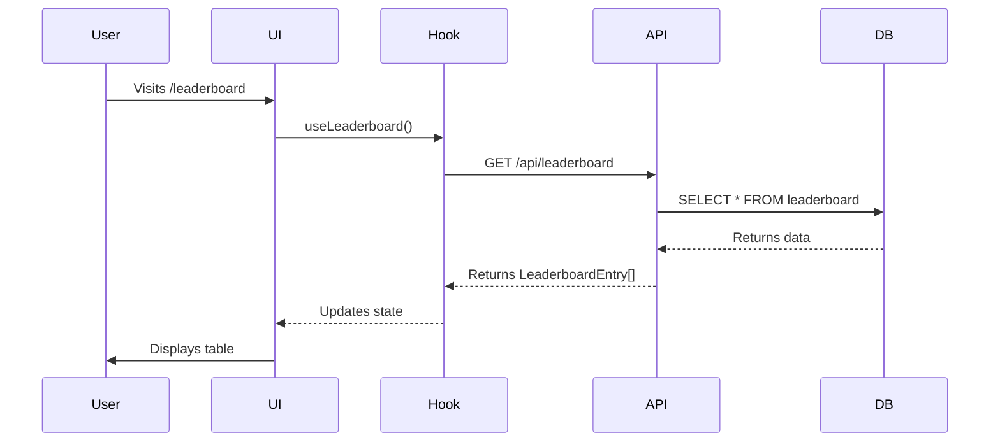

# 10 - Architecture Patterns & File Organization
**Version:** 1.0.0
**Last Updated:** 2025-10-10
**Purpose:** Advanced architecture patterns, file structure conventions, and organization best practices

---

## ⚠️ **DO NOT MODIFY THIS DOCUMENT**

**This is a REFERENCE document. Claude Code should READ and FOLLOW this document, but NEVER modify it unless the user explicitly requests an update.**

**Exception:** Only modify if the user specifically asks: "Update the Claude DOCS" or "Modify 10_ARCHITECTURE_PATTERNS.md"

---

## 📋 CORE PRINCIPLES

### 1. **Small Files, Single Responsibility**
- **Max 300 lines per file** - If larger, break it down
- **One component per file** - No multiple components in one file
- **One concern per module** - UI logic separate from business logic

### 2. **Feature-Based Organization**
- Group by feature, not by type
- Each feature should be self-contained
- Related files live together

### 3. **Logical Separation**
- **Components** - UI only, minimal logic
- **Hooks/Composables** - Reusable stateful logic
- **Utils** - Pure functions, no side effects
- **Services** - API calls, external integrations
- **Types** - TypeScript definitions
- **Constants** - Configuration, enums, magic numbers

### 4. **Documentation in Code**
- Every file has a header comment explaining WHY it exists
- Complex logic has inline comments
- Public functions have JSDoc/docstrings
- README in feature folders

---

## 🏗️ PROJECT STRUCTURES BY TYPE

### Next.js 15 (App Router) - Web Application

```
my-app/
├── app/                          # App Router (Next.js 15+)
│   ├── (auth)/                   # Route group - auth flows
│   │   ├── login/
│   │   │   └── page.tsx
│   │   ├── signup/
│   │   │   └── page.tsx
│   │   └── layout.tsx            # Auth layout
│   ├── (dashboard)/              # Route group - authenticated pages
│   │   ├── profile/
│   │   │   └── page.tsx
│   │   ├── settings/
│   │   │   └── page.tsx
│   │   └── layout.tsx            # Dashboard layout
│   ├── api/                      # API routes
│   │   ├── auth/
│   │   │   └── route.ts
│   │   └── leaderboard/
│   │       └── route.ts
│   ├── layout.tsx                # Root layout
│   ├── page.tsx                  # Home page
│   └── error.tsx                 # Error boundary
│
├── components/                   # Shared UI components
│   ├── ui/                       # Generic UI primitives (shadcn/ui)
│   │   ├── button.tsx
│   │   ├── input.tsx
│   │   ├── card.tsx
│   │   └── index.ts              # Barrel export
│   ├── features/                 # Feature-specific components
│   │   ├── auth/
│   │   │   ├── LoginForm.tsx
│   │   │   ├── SignupForm.tsx
│   │   │   └── index.ts
│   │   └── leaderboard/
│   │       ├── LeaderboardTable.tsx
│   │       ├── LeaderboardFilters.tsx
│   │       ├── LeaderboardRow.tsx
│   │       └── index.ts
│   └── layout/                   # Layout components
│       ├── Header.tsx
│       ├── Footer.tsx
│       ├── Sidebar.tsx
│       └── index.ts
│
├── lib/                          # Shared utilities & configs
│   ├── supabase/                 # Supabase client & utilities
│   │   ├── client.ts             # Browser client
│   │   ├── server.ts             # Server client
│   │   ├── queries.ts            # Reusable queries
│   │   └── types.ts              # Database types
│   ├── utils/                    # Utility functions
│   │   ├── cn.ts                 # className merger
│   │   ├── format.ts             # Formatters
│   │   └── validation.ts         # Validators
│   └── constants.ts              # App-wide constants
│
├── hooks/                        # Custom React hooks
│   ├── useAuth.ts
│   ├── useLeaderboard.ts
│   ├── useLocalStorage.ts
│   └── index.ts
│
├── store/                        # State management (Zustand)
│   ├── authStore.ts
│   ├── uiStore.ts
│   └── index.ts
│
├── types/                        # TypeScript types
│   ├── api.ts                    # API response types
│   ├── database.ts               # Database types
│   ├── ui.ts                     # UI component types
│   └── index.ts
│
├── styles/
│   └── globals.css               # Global styles + Tailwind
│
├── public/                       # Static assets
│   ├── images/
│   ├── fonts/
│   └── icons/
│
├── tests/                        # Test files
│   ├── unit/
│   ├── integration/
│   └── e2e/
│       └── leaderboard.spec.ts
│
├── docs/                         # Project documentation
│   ├── PRD-leaderboard.md
│   ├── TASKS-leaderboard.md
│   └── ARCHITECTURE.md
│
├── .env.local                    # Environment variables
├── .env.example                  # Example env vars
├── next.config.js
├── tailwind.config.ts
├── tsconfig.json
├── package.json
└── README.md
```

**Why This Structure:**
- **Route groups** `(auth)`, `(dashboard)` organize without affecting URLs
- **Feature folders** in `components/features/` keep related UI together
- **Colocation** - Tests live near code they test
- **Clear separation** - UI (components) vs Logic (hooks/store) vs Data (lib)

---

### SvelteKit - Game/Interactive App

```
my-game/
├── src/
│   ├── routes/                   # SvelteKit routes
│   │   ├── (app)/                # Route group - main app
│   │   │   ├── game/
│   │   │   │   ├── +page.svelte
│   │   │   │   ├── +page.ts      # Load function
│   │   │   │   └── +page.server.ts # Server load
│   │   │   ├── leaderboard/
│   │   │   │   └── +page.svelte
│   │   │   └── +layout.svelte
│   │   ├── api/                  # API endpoints
│   │   │   └── game/
│   │   │       └── +server.ts
│   │   ├── +layout.svelte        # Root layout
│   │   └── +page.svelte          # Home
│   │
│   ├── lib/                      # Library code
│   │   ├── components/           # UI components
│   │   │   ├── game/
│   │   │   │   ├── Board.svelte
│   │   │   │   ├── Piece.svelte
│   │   │   │   └── index.ts
│   │   │   ├── ui/
│   │   │   │   ├── Button.svelte
│   │   │   │   └── Card.svelte
│   │   │   └── index.ts
│   │   │
│   │   ├── stores/               # Svelte stores
│   │   │   ├── game.ts           # Game state
│   │   │   ├── user.ts           # User state
│   │   │   └── index.ts
│   │   │
│   │   ├── game/                 # Game logic (pure)
│   │   │   ├── engine.ts         # Game engine
│   │   │   ├── rules.ts          # Game rules
│   │   │   ├── ai.ts             # AI logic
│   │   │   └── types.ts
│   │   │
│   │   ├── services/             # External services
│   │   │   ├── api.ts            # API client
│   │   │   ├── supabase.ts       # Supabase client
│   │   │   └── stockfish.ts      # Stockfish engine
│   │   │
│   │   ├── utils/
│   │   │   ├── format.ts
│   │   │   └── validation.ts
│   │   │
│   │   └── types/
│   │       ├── game.ts
│   │       └── api.ts
│   │
│   ├── assets/                   # Static assets
│   │   ├── images/
│   │   ├── sounds/
│   │   └── sprites/
│   │
│   └── styles/
│       └── global.css
│
├── static/                       # Public files
├── tests/
├── docs/
├── svelte.config.js
├── vite.config.ts
├── tailwind.config.ts
└── package.json
```

**Why This Structure:**
- **Game logic separate** from UI (`lib/game/`)
- **Stores** for reactive state management
- **Services** for external integrations (Supabase, Stockfish)
- **Pure functions** in `lib/game/` make testing easier

---

### Desktop App (Tauri)

```
my-desktop-app/
├── src/                          # Frontend (web tech)
│   ├── App.tsx
│   ├── main.tsx
│   ├── components/
│   ├── hooks/
│   ├── store/
│   └── styles/
│
├── src-tauri/                    # Rust backend
│   ├── src/
│   │   ├── main.rs               # Entry point
│   │   ├── commands.rs           # Tauri commands
│   │   ├── database.rs           # SQLite logic
│   │   ├── filesystem.rs         # File operations
│   │   └── lib.rs
│   ├── icons/
│   ├── Cargo.toml
│   └── tauri.conf.json
│
├── public/
├── tests/
└── package.json
```

**Why This Structure:**
- **Clear separation** between web UI and Rust backend
- **Commands** expose Rust functions to frontend
- **Database/filesystem** logic in Rust for security

---

### Mobile App (Flutter)

```
my_mobile_app/
├── lib/
│   ├── main.dart                 # Entry point
│   │
│   ├── app/                      # App-level
│   │   ├── app.dart              # Root widget
│   │   ├── routes.dart           # Navigation
│   │   └── theme.dart            # Theme config
│   │
│   ├── features/                 # Feature modules
│   │   ├── auth/
│   │   │   ├── models/
│   │   │   │   └── user.dart
│   │   │   ├── providers/
│   │   │   │   └── auth_provider.dart
│   │   │   ├── screens/
│   │   │   │   ├── login_screen.dart
│   │   │   │   └── signup_screen.dart
│   │   │   ├── widgets/
│   │   │   │   └── login_form.dart
│   │   │   └── services/
│   │   │       └── auth_service.dart
│   │   │
│   │   └── game/
│   │       ├── models/
│   │       ├── providers/
│   │       ├── screens/
│   │       ├── widgets/
│   │       └── services/
│   │
│   ├── shared/                   # Shared code
│   │   ├── widgets/              # Reusable widgets
│   │   ├── utils/
│   │   ├── constants/
│   │   └── services/
│   │       ├── api_service.dart
│   │       └── storage_service.dart
│   │
│   └── core/                     # Core utilities
│       ├── error/
│       ├── network/
│       └── logger/
│
├── assets/
│   ├── images/
│   ├── fonts/
│   └── icons/
│
├── test/
├── android/
├── ios/
├── pubspec.yaml
└── README.md
```

**Why This Structure:**
- **Feature modules** are self-contained (models, screens, widgets, services)
- **Shared** code reused across features
- **Core** provides app-wide utilities

---

## 📏 FILE SIZE & COMPLEXITY RULES

### File Size Limits

| File Type | Max Lines | Recommended | Action if Exceeded |
|-----------|-----------|-------------|-------------------|
| Component | 300 | 150-200 | Extract sub-components |
| Hook/Composable | 200 | 50-100 | Split into multiple hooks |
| Service | 400 | 200-300 | Split by responsibility |
| Utility | 150 | 50-100 | One util per file |
| Type definitions | 500 | 200-300 | Group by domain |

### Function Complexity Limits

| Metric | Max | Recommended | Action if Exceeded |
|--------|-----|-------------|-------------------|
| Lines per function | 50 | 10-20 | Extract helper functions |
| Parameters | 5 | 2-3 | Use options object |
| Cyclomatic complexity | 10 | 5 | Break into smaller functions |
| Nesting depth | 4 | 2-3 | Extract nested logic |

---

## 🎯 COMPONENT PATTERNS

### 1. Component Header Documentation

Every component file should start with:

```typescript
/**
 * LeaderboardTable.tsx
 *
 * Purpose: Displays paginated leaderboard with player rankings
 * Used in: /leaderboard page
 * Dependencies: useLeaderboard hook, LeaderboardRow component
 *
 * Why: Separates table logic from page logic for reusability
 * Could be reused in: User profile page, tournament pages
 *
 * Last modified: 2025-10-10
 * Author: Claude Code
 */

import { useLeaderboard } from '@/hooks/useLeaderboard';
import { LeaderboardRow } from './LeaderboardRow';

export function LeaderboardTable() {
  // Implementation
}
```

### 2. Component Composition

**Bad - Monolithic Component:**
```typescript
// ❌ DON'T: 500-line component with everything
function LeaderboardPage() {
  // Fetching logic
  // Filtering logic
  // Sorting logic
  // Pagination logic
  // Table rendering
  // Modal logic
  // Form logic
  // ...
}
```

**Good - Composed Components:**
```typescript
// ✅ DO: Break into logical components

// Page component (orchestration only)
function LeaderboardPage() {
  return (
    <div>
      <LeaderboardHeader />
      <LeaderboardFilters />
      <LeaderboardTable />
      <LeaderboardPagination />
    </div>
  );
}

// Each component has single responsibility
function LeaderboardTable() {
  const { data } = useLeaderboard();
  return (
    <table>
      {data.map(entry => (
        <LeaderboardRow key={entry.id} entry={entry} />
      ))}
    </table>
  );
}
```

### 3. Logic Extraction

**Bad - Logic in Component:**
```typescript
// ❌ DON'T: Business logic mixed with UI
function LeaderboardTable() {
  const [data, setData] = useState([]);
  const [loading, setLoading] = useState(false);

  useEffect(() => {
    setLoading(true);
    fetch('/api/leaderboard')
      .then(res => res.json())
      .then(data => setData(data))
      .finally(() => setLoading(false));
  }, []);

  return <table>...</table>;
}
```

**Good - Logic in Hook:**
```typescript
// ✅ DO: Extract to custom hook

// hooks/useLeaderboard.ts
export function useLeaderboard() {
  const [data, setData] = useState([]);
  const [loading, setLoading] = useState(false);

  useEffect(() => {
    setLoading(true);
    fetch('/api/leaderboard')
      .then(res => res.json())
      .then(data => setData(data))
      .finally(() => setLoading(false));
  }, []);

  return { data, loading };
}

// components/LeaderboardTable.tsx
function LeaderboardTable() {
  const { data, loading } = useLeaderboard();
  if (loading) return <Spinner />;
  return <table>...</table>;
}
```

---

## 🔧 UTILITY & SERVICE PATTERNS

### 1. Pure Utility Functions

```typescript
/**
 * utils/format.ts
 *
 * Purpose: Pure formatting functions (no side effects)
 * Why: Reusable, testable, predictable
 */

/**
 * Formats a number as percentage
 * @example formatPercent(0.685) => "68.5%"
 */
export function formatPercent(value: number, decimals = 1): string {
  return `${(value * 100).toFixed(decimals)}%`;
}

/**
 * Formats a rating with change indicator
 * @example formatRating(2847, 12) => "2847 ↑12"
 */
export function formatRating(rating: number, change?: number): string {
  if (!change) return rating.toString();
  const arrow = change > 0 ? '↑' : '↓';
  return `${rating} ${arrow}${Math.abs(change)}`;
}

// More utility functions...
```

### 2. Service Layer (API Calls)

```typescript
/**
 * services/api/leaderboard.ts
 *
 * Purpose: Leaderboard API client functions
 * Why: Centralize API logic, make endpoints easy to update
 */

import { supabase } from '@/lib/supabase/client';
import type { LeaderboardEntry, LeaderboardFilters } from '@/types';

export const leaderboardService = {
  /**
   * Fetches paginated leaderboard data
   */
  async getLeaderboard(filters: LeaderboardFilters) {
    const { data, error } = await supabase
      .from('leaderboard')
      .select('*')
      .order('rank', { ascending: true })
      .range(filters.offset, filters.offset + filters.limit - 1);

    if (error) throw error;
    return data as LeaderboardEntry[];
  },

  /**
   * Gets current user's rank
   */
  async getUserRank(userId: string) {
    const { data, error } = await supabase
      .from('leaderboard')
      .select('rank')
      .eq('user_id', userId)
      .single();

    if (error) throw error;
    return data.rank;
  },
};
```

---

## 📦 BARREL EXPORTS (index.ts)

Use barrel exports to simplify imports:

```typescript
// components/features/leaderboard/index.ts

/**
 * Leaderboard Feature Exports
 *
 * Purpose: Single import point for all leaderboard components
 * Usage: import { LeaderboardTable, LeaderboardFilters } from '@/components/features/leaderboard'
 */

export { LeaderboardTable } from './LeaderboardTable';
export { LeaderboardFilters } from './LeaderboardFilters';
export { LeaderboardRow } from './LeaderboardRow';
export { LeaderboardPagination } from './LeaderboardPagination';
export { LeaderboardEmpty } from './LeaderboardEmpty';
export { LeaderboardError } from './LeaderboardError';
export { LeaderboardSkeleton } from './LeaderboardSkeleton';
```

**Usage:**
```typescript
// Before (verbose)
import { LeaderboardTable } from '@/components/features/leaderboard/LeaderboardTable';
import { LeaderboardFilters } from '@/components/features/leaderboard/LeaderboardFilters';

// After (clean)
import { LeaderboardTable, LeaderboardFilters } from '@/components/features/leaderboard';
```

---

## 🗂️ FOLDER-LEVEL README

Each feature folder should have a README:

```markdown
<!-- components/features/leaderboard/README.md -->

# Leaderboard Feature

## Purpose
Displays player rankings with filtering, sorting, and pagination.

## Components

### LeaderboardTable
Main table component showing player rankings.
- **Props:** None (uses useLeaderboard hook internally)
- **State:** None (stateless presentation)
- **Used in:** `/leaderboard` page

### LeaderboardFilters
Filter controls (timeframe, friends, search).
- **Props:** `onFilterChange: (filters: Filters) => void`
- **State:** Controlled by parent
- **Used in:** `/leaderboard` page

[... document all components ...]

## Data Flow
```
User Action → LeaderboardFilters
            ↓
          useLeaderboard hook
            ↓
          API call (services/api/leaderboard.ts)
            ↓
          Supabase
            ↓
          LeaderboardTable renders
```

## Testing
- Unit tests: `__tests__/LeaderboardTable.test.tsx`
- E2E tests: `tests/e2e/leaderboard.spec.ts`

## Future Improvements
- [ ] Add real-time updates via Supabase Realtime
- [ ] Add export to CSV functionality
- [ ] Add filtering by country/region
```

---

## 🧪 TEST ORGANIZATION

```
tests/
├── unit/                         # Unit tests (isolated)
│   ├── components/
│   │   └── LeaderboardTable.test.tsx
│   ├── hooks/
│   │   └── useLeaderboard.test.ts
│   └── utils/
│       └── format.test.ts
│
├── integration/                  # Integration tests (multiple units)
│   └── leaderboard-flow.test.ts
│
└── e2e/                          # End-to-end tests (Playwright)
    ├── auth.spec.ts
    ├── leaderboard.spec.ts
    └── game.spec.ts
```

**Naming Convention:**
- Unit tests: `ComponentName.test.tsx` or `functionName.test.ts`
- E2E tests: `feature-name.spec.ts`

---

## 🔄 WORKFLOW DIAGRAMS

Include Mermaid diagrams in READMEs:

````markdown
## Leaderboard Data Flow


````

---

## 📋 REDUNDANCY PREVENTION CHECKLIST

Before creating a new file:

- [ ] Does similar functionality already exist?
- [ ] Can I extend an existing file instead?
- [ ] Is this truly a separate concern?
- [ ] Will this file be reused elsewhere?
- [ ] Is this file < 300 lines?
- [ ] Does it have a single, clear responsibility?

**Use Grep/GitHub MCP to search for existing patterns:**
```bash
# Search for similar components
grep -r "Leaderboard" components/

# Search for similar hooks
grep -r "useLeader" hooks/

# Search for similar API calls
grep -r "leaderboard" services/
```

---

## 🚨 COMMON ANTI-PATTERNS TO AVOID

| Anti-Pattern | Why Bad | Solution |
|--------------|---------|----------|
| **God Component** | 1000+ line component | Break into smaller components |
| **Prop Drilling** | Passing props 5+ levels | Use context or state management |
| **Tight Coupling** | Component depends on specific API | Use abstraction layer (service/hook) |
| **Magic Numbers** | Hardcoded values everywhere | Extract to constants |
| **Duplicate Logic** | Copy-paste same code | Extract to utility/hook |
| **Mixed Concerns** | UI + API + business logic | Separate into layers |
| **No Documentation** | No one knows why it exists | Add header comments |
| **Unclear Naming** | `component1.tsx`, `util.ts` | Descriptive names |

---

## 📊 QUALITY METRICS

**File Structure Health Check:**
```bash
# Check file sizes
find . -name "*.tsx" -o -name "*.ts" | xargs wc -l | sort -rn

# Files > 300 lines need refactoring
```

**Component Complexity:**
```bash
# Use ESLint with complexity rules
{
  "rules": {
    "complexity": ["error", 10],
    "max-lines": ["error", 300],
    "max-lines-per-function": ["error", 50]
  }
}
```

---

## 🔗 RELATED DOCUMENTS

- [MASTER_WORKFLOW.md](MASTER_WORKFLOW.md) - Overall workflow
- [03_TASK_GENERATION.md](03_TASK_GENERATION.md) - Task breakdown uses this structure
- [04_IMPLEMENTATION.md](04_IMPLEMENTATION.md) - Implementation follows these patterns

---

**Remember:** Good architecture makes code easy to understand, test, and modify. Always prefer clarity over cleverness!
