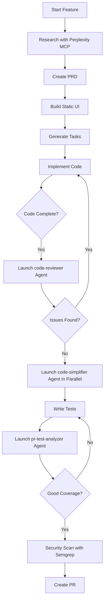
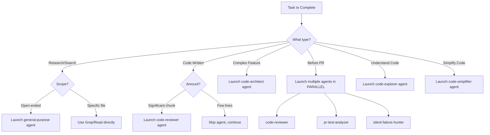

# 11 - Sub-Agent Usage & Parallel Execution
**Version:** 1.0.0
**Last Updated:** 2025-10-10
**Purpose:** When and how to use Claude Code sub-agents for efficient parallel work

---

## ⚠️ **DO NOT MODIFY THIS DOCUMENT**

**This is a REFERENCE document. Exception:** Only modify if user explicitly requests.

---

## 📋 WHAT ARE SUB-AGENTS?

Sub-agents are specialized Claude Code agents that can work autonomously on specific tasks while you continue other work. Think of them as delegating work to expert assistants.

**Key Benefits:**
- ✅ **Parallel work** - Multiple tasks running simultaneously
- ✅ **Specialized expertise** - Each agent is optimized for specific tasks
- ✅ **Reduced context** - Main agent doesn't need to load everything
- ✅ **Faster completion** - Work happens in background

---

## 🎯 AVAILABLE SUB-AGENTS

### General Purpose
| Agent | Purpose | When to Use |
|-------|---------|-------------|
| **general-purpose** | Research, file search, multi-step tasks | Open-ended searches, complex research |

### PR Review Toolkit
| Agent | Purpose | When to Use |
|-------|---------|-------------|
| **code-reviewer** | Check code quality, style, best practices | After writing code, before PR |
| **code-simplifier** | Simplify complex code while preserving functionality | After initial implementation |
| **comment-analyzer** | Review code comments for accuracy | After adding documentation |
| **pr-test-analyzer** | Review test coverage in PR | Before merging PR |
| **silent-failure-hunter** | Find suppressed errors, bad error handling | After implementing error handling |
| **type-design-analyzer** | Review TypeScript type design | When creating new types |

### Feature Development
| Agent | Purpose | When to Use |
|-------|---------|-------------|
| **code-architect** | Design feature architecture | Before starting large features |
| **code-explorer** | Analyze existing codebase patterns | Before implementing similar feature |
| **code-reviewer (feature-dev)** | Review for bugs, security, quality | Before deployment |

---

## ⚡ WHEN TO USE SUB-AGENTS

### ✅ **DO Use Sub-Agents For:**

1. **After Writing Code** (Proactive Quality)
   ```
   You: "I've implemented the authentication system"
   Claude: Uses code-reviewer agent automatically
   ```

2. **Before Creating PR**
   ```
   You: "Ready to create PR for user profile feature"
   Claude: Launches code-reviewer + pr-test-analyzer in parallel
   ```

3. **Complex Research**
   ```
   You: "Find the best way to implement real-time chess moves"
   Claude: Launches general-purpose agent for deep research
   ```

4. **Analyzing Large Codebases**
   ```
   You: "How does authentication work in this project?"
   Claude: Launches code-explorer agent to trace execution
   ```

5. **Parallel Independent Tasks**
   ```
   You: "Review security AND test coverage"
   Claude: Launches silent-failure-hunter + pr-test-analyzer in parallel
   ```

### ❌ **DON'T Use Sub-Agents For:**

1. **Simple file reads** - Use Read tool directly
2. **Searching specific files** - Use Grep tool
3. **Quick questions** - Main agent is faster
4. **Single-step tasks** - Overhead not worth it

---

## 🚀 WORKFLOW INTEGRATION

### Updated Development Workflow with Sub-Agents



### Integration Points in Existing Workflow

**In 04_IMPLEMENTATION.md** (Add After Step 6):
```markdown
### 6a. Launch Code Review Agent

After implementing feature:

**Automatic Review:**
Claude Code should proactively launch code-reviewer agent after:
- Completing a sub-task
- Writing a logical chunk of code
- Before moving to next task

**Manual Request:**
"Please review the authentication code I just wrote"
```

**In 03_TASK_GENERATION.md** (Add Before Implementation):
```markdown
### 3a. Optionally: Launch Code Architect Agent

For complex features, consider launching code-architect agent to:
- Analyze existing codebase patterns
- Design feature architecture
- Provide implementation blueprint
```

**In 05_SECURITY_CHECKLIST.md** (Add to Post-Implementation):
```markdown
### Run Silent Failure Hunter Agent

After implementing error handling:
- Launch silent-failure-hunter agent
- Reviews try-catch blocks
- Identifies suppressed errors
- Checks fallback behavior
```

---

## 📝 USAGE EXAMPLES

### Example 1: After Writing Code (Proactive)

```markdown
**User:** "I've added the user profile editing feature"

**Claude Code (automatically):**
1. Launches code-reviewer agent to check:
   - Style violations
   - Potential bugs
   - Best practices
2. Reports findings
3. Fixes critical issues
4. Marks task complete
```

### Example 2: Before PR (Parallel Agents)

```markdown
**User:** "I'm ready to create a PR for the leaderboard feature"

**Claude Code:**
1. Launches THREE agents in parallel:
   - code-reviewer (check quality)
   - pr-test-analyzer (check coverage)
   - silent-failure-hunter (check error handling)
2. Waits for all to complete
3. Consolidates findings
4. Fixes issues
5. Creates PR
```

### Example 3: Complex Feature Planning

```markdown
**User:** "I want to add real-time multiplayer to the chess game"

**Claude Code:**
1. Launches code-architect agent with:
   - Feature description
   - Current codebase analysis
   - Expected output: architecture blueprint
2. While agent works, continues conversation
3. Agent returns with:
   - Recommended architecture
   - Files to create/modify
   - Data flow diagrams
   - Build sequence
```

### Example 4: Understanding Existing Code

```markdown
**User:** "How does the puzzle generation work?"

**Claude Code:**
1. Launches code-explorer agent to:
   - Trace execution paths
   - Map architecture layers
   - Document dependencies
2. Returns comprehensive analysis
3. Explains to user
```

---

## 🔧 PRACTICAL IMPLEMENTATION

### Add to MASTER_WORKFLOW.md

```markdown
## 🤖 SUB-AGENT USAGE PRINCIPLES

1. **Proactive Quality Checks**
   - After writing significant code → Launch code-reviewer
   - Before PR → Launch code-reviewer + test-analyzer
   - After error handling → Launch silent-failure-hunter

2. **Parallel Execution**
   - When reviewing PR → Run code-reviewer + test-analyzer + failure-hunter in PARALLEL
   - Don't run sequentially unless dependent

3. **Specialized Tasks**
   - Complex feature planning → code-architect
   - Understanding codebase → code-explorer
   - Type design review → type-design-analyzer

4. **User Requests**
   - User says "review code" → Use code-reviewer agent
   - User says "simplify this" → Use code-simplifier agent
```

### Add to 04_IMPLEMENTATION.md

```markdown
## STEP 6A: LAUNCH CODE REVIEW AGENT

**After implementing each sub-task:**

```bash
# Claude Code automatically launches code-reviewer agent:
# - Reviews recent changes (git diff)
# - Checks against project guidelines
# - Identifies style violations
# - Finds potential bugs
# - Suggests improvements
```

**Wait for agent report, then:**
- Fix critical issues immediately
- Document medium issues for later
- Mark task complete only after agent approval
```

### Add to 03_TASK_GENERATION.md

```markdown
## OPTIONAL: LAUNCH CODE ARCHITECT AGENT

**For complex features (20+ tasks), consider:**

Before generating detailed tasks:
1. Launch code-architect agent with:
   - PRD document
   - Current codebase context
   - Expected architecture
2. Agent provides:
   - Recommended file structure
   - Component designs
   - Data flows
   - Build sequence
3. Use output to inform task generation
```

---

## 🎯 DECISION FLOWCHART



---

## 📊 EFFICIENCY GAINS

### Without Sub-Agents (Sequential)
```
Research (10 min) → Implement (30 min) → Review manually (15 min)
→ Test check (10 min) → Security check (10 min)
= 75 minutes total
```

### With Sub-Agents (Parallel)
```
Research (10 min) → Implement (30 min)
→ [code-reviewer + test-analyzer + failure-hunter in parallel] (15 min)
= 55 minutes total (27% faster)
```

---

## 🚨 IMPORTANT NOTES

### Agent Limitations
- ✅ Agents work autonomously (can't ask questions mid-task)
- ✅ Provide complete context upfront
- ✅ Specify exactly what output you need
- ✅ Each agent invocation is stateless

### Best Practices
```markdown
**Good Agent Prompt:**
"Launch code-reviewer agent to review all files changed in the last commit.
Focus on: security issues, error handling, and code style.
Return: list of issues with severity (critical/medium/low) and suggested fixes."

**Bad Agent Prompt:**
"Review the code"  (too vague, agent won't know what to focus on)
```

### Parallel Execution
```typescript
// To run agents in PARALLEL, use single message with multiple Task calls
// GOOD:
const results = await Promise.all([
  Task({ agent: 'code-reviewer', prompt: '...' }),
  Task({ agent: 'pr-test-analyzer', prompt: '...' }),
  Task({ agent: 'silent-failure-hunter', prompt: '...' })
]);

// BAD (sequential, slow):
await Task({ agent: 'code-reviewer', prompt: '...' });
await Task({ agent: 'pr-test-analyzer', prompt: '...' });
await Task({ agent: 'silent-failure-hunter', prompt: '...' });
```

---

## 🔗 UPDATED DOCUMENT REFERENCES

The following docs should now reference sub-agents:

- **MASTER_WORKFLOW.md** → Add sub-agent principles
- **04_IMPLEMENTATION.md** → Add code-reviewer after each task
- **03_TASK_GENERATION.md** → Add optional code-architect
- **05_SECURITY_CHECKLIST.md** → Add silent-failure-hunter
- **06_TESTING_VERIFICATION.md** → Add pr-test-analyzer

---

## 🎓 LEARNING TO USE SUB-AGENTS

**Start simple:**
1. After writing your next feature, ask: "Please review my code"
2. Claude Code will use code-reviewer agent
3. Observe how it works
4. Gradually use more agents

**Advance to parallel:**
1. Before creating PR, ask: "Review code quality, test coverage, and error handling"
2. Claude Code will launch 3 agents in parallel
3. See efficiency gains

---

## ✅ QUICK REFERENCE

| Scenario | Agent(s) to Use | Run in Parallel? |
|----------|----------------|------------------|
| Just finished coding | code-reviewer | No |
| Before creating PR | code-reviewer + pr-test-analyzer + silent-failure-hunter | YES |
| Planning complex feature | code-architect | No |
| Understanding existing code | code-explorer | No |
| Code is too complex | code-simplifier | No |
| Added many comments | comment-analyzer | No |
| Created new TypeScript types | type-design-analyzer | No |
| Open-ended research | general-purpose | No |

---

**Remember:** Sub-agents make Claude Code more efficient, but don't use them for simple tasks. Use your judgment!
