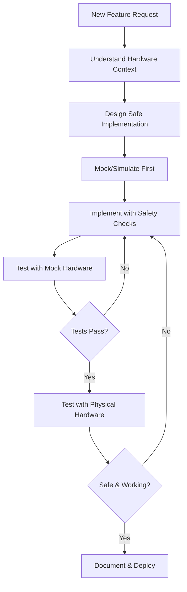

# MASTER WORKFLOW - Chess Mover Machine
**Version:** 1.0.0
**Last Updated:** 2025-01-18
**Purpose:** Hardware control project workflow - Python, Tkinter, GRBL, Raspberry Pi

---

## ⚠️ **DO NOT MODIFY THIS DOCUMENT**

**This is a REFERENCE document. Only modify if user explicitly requests: "Update the Claude DOCS"**

---

## 📋 HARDWARE CONTROL WORKFLOW



---

## 🎯 CORE PRINCIPLES (Hardware-Specific)

### 1. **Safety First, Always**
- **Validate before executing** - Check bounds, limits, connection
- **Emergency stop** - Always implement abort/kill functionality
- **Graceful degradation** - Handle errors without dangerous behavior
- **Test in simulation** - Mock hardware before physical testing
- **Conservative defaults** - Slow speeds, soft limits enabled

### 2. **Hardware Abstraction**
- **Separate layers**: UI ← Logic ← Hardware Controller
- **Mock interfaces** - Testable without physical hardware
- **Configuration-driven** - Hardware params in YAML, not code
- **Platform-independent** - Works on Windows & Raspberry Pi

### 3. **State Management**
- Track **hardware state**: connected, position, homed, idle
- Prevent **concurrent commands** - Queue or block duplicate requests
- **Error recovery** - Reset to known good state after failures
- **Logging** - Comprehensive debugging info

### 4. **Coordinate Systems**
- **Chess coordinates** (A1-H8) for user interface
- **Machine coordinates** (X/Y mm) for GRBL
- **Work offset** (G54) for board alignment
- **Transform layer** - Clean separation between systems

---

## 🗂️ PROJECT STRUCTURE

```
chess_mover/
├── main.py                      # Entry point - Tkinter app
│
├── config/
│   └── settings.yaml           # COM port, dimensions, profiles
│
├── ui/                         # Tkinter GUI layer
│   ├── main_window.py          # Main application window
│   ├── board_canvas.py         # Interactive chess board
│   └── settings_dialog.py      # Configuration UI
│
├── controllers/                # Hardware control layer
│   ├── grbl_controller.py     # Serial/GRBL communication
│   └── servo_controller.py     # Servo control (Phase 3)
│
├── logic/                      # Business logic layer
│   ├── coordinate_converter.py # Chess coords ←→ Machine coords
│   ├── path_planner.py        # Movement planning & safety
│   └── state_manager.py       # Application state tracking
│
├── tests/                      # Testing
│   ├── test_grbl_mock.py      # Mock GRBL tests
│   ├── test_coordinates.py    # Coordinate conversion tests
│   └── test_path_planning.py  # Path planning tests
│
├── docs/                       # Feature documentation
│   └── CALIBRATION_GUIDE.md
│
└── requirements.txt            # pyserial, pyyaml
```

**File Size Limits:**
- Max 300 lines per file
- Max 50 lines per function
- If larger, break into modules

---

## 🔧 RECOMMENDED TECH STACK

### Phase 1: Windows Development
```yaml
Language: Python 3.11+ (you have 3.12.10)
GUI Framework: Tkinter (built-in, cross-platform)
Serial Communication: pyserial 3.5+
Configuration: PyYAML 6.0+
Testing: pytest + unittest.mock
Logging: Python logging module
```

### Phase 2: Raspberry Pi
```yaml
Platform: Raspberry Pi OS (Lite or Full)
Python: 3.11+ (same codebase)
Display: VNC or local 7" touchscreen
Auto-start: systemd service
USB: /dev/ttyUSB0 or /dev/ttyACM0
```

### Phase 3: Servo Control
```yaml
PWM Controller: PCA9685 (I2C)
Library: adafruit-circuitpython-pca9685
Power: 6V LM2596 buck converter
GPIO: RPi.GPIO (Raspberry Pi only)
Common Ground: Falcon + Pi + Servo rail
```

---

## 🚀 DEVELOPMENT WORKFLOW

### Step 1: Understand Hardware Requirements

**Before coding, answer:**
1. What physical hardware is involved? (motors, sensors, servos)
2. What communication protocol? (Serial/GRBL, I2C, GPIO)
3. What are the safety limits? (work area, speed, acceleration)
4. What can go wrong? (disconnection, out-of-bounds, collisions)
5. How to test without hardware? (mock objects, simulators)

### Step 2: Design with Safety

**Every hardware feature must have:**
- ✅ **Input validation** - Range checks on coordinates
- ✅ **Bounds checking** - Machine work area limits
- ✅ **Error handling** - Serial timeouts, GRBL errors
- ✅ **Emergency stop** - Abort mechanism (Ctrl+C, button, `!` to GRBL)
- ✅ **State tracking** - Know current position/state
- ✅ **Logging** - Debug info for troubleshooting

### Step 3: Implement Layers Separately

```python
# Layer 1: Hardware Controller (grbl_controller.py)
class GRBLController:
    """Low-level GRBL communication - knows nothing about chess"""
    def connect(self, port: str, baud: int) -> bool
    def send_command(self, cmd: str) -> str
    def home(self) -> bool
    def move_absolute(self, x: float, y: float, feed_rate: int) -> bool
    def get_position(self) -> tuple[float, float]
    def emergency_stop(self) -> bool

# Layer 2: Business Logic (coordinate_converter.py)
class CoordinateConverter:
    """Chess coordinates ←→ Machine coordinates"""
    def chess_to_machine(self, square: str) -> tuple[float, float]
    def machine_to_chess(self, x: float, y: float) -> str
    def validate_square(self, square: str) -> bool

# Layer 3: UI (board_canvas.py)
class BoardCanvas:
    """Tkinter canvas - knows nothing about GRBL"""
    def on_square_click(self, square: str):
        machine_coords = self.converter.chess_to_machine(square)
        if self.path_planner.is_safe(machine_coords):
            self.grbl.move_absolute(*machine_coords)
```

**Why separate layers?**
- Test logic without hardware
- Swap GRBL for simulator easily
- Replace Tkinter with web UI later
- Clear responsibilities

### Step 4: Mock First, Hardware Later

**Create mock versions for testing:**

```python
# tests/mock_grbl.py
class MockGRBLController:
    """Simulates GRBL without serial port"""
    def __init__(self):
        self.x = 0.0
        self.y = 0.0
        self.is_connected = False
        self.is_homed = False

    def connect(self, port, baud):
        print(f"[MOCK] Connected to {port}")
        self.is_connected = True
        return True

    def move_absolute(self, x, y, feed_rate):
        if not self.is_homed:
            raise Exception("Not homed!")
        print(f"[MOCK] Moving to X{x} Y{y} F{feed_rate}")
        self.x, self.y = x, y
        return True
```

**Benefits:**
- Develop without hardware plugged in
- Fast iteration cycle
- Safe testing of edge cases
- CI/CD friendly

### Step 5: Test Hierarchy

```
1. Unit Tests (mock hardware)
   ├── Coordinate conversion logic
   ├── Bounds checking
   └── Path planning

2. Integration Tests (mock GRBL)
   ├── UI → Logic → Mock Controller
   └── Full workflow without serial port

3. Hardware Tests (real GRBL)
   ├── Serial connection
   ├── Homing cycle
   ├── Single move
   └── Full test path
```

**Run in order:**
```bash
# Fast tests (no hardware)
pytest tests/test_coordinates.py
pytest tests/test_path_planning.py

# Integration (mock controller)
pytest tests/test_integration.py

# Hardware tests (manual, with Falcon connected)
python tests/test_hardware.py
```

### Step 6: Physical Hardware Testing

**Safety checklist before running:**
- [ ] Emergency stop accessible
- [ ] Work area clear of obstacles
- [ ] Machine homed and calibrated
- [ ] Conservative feed rates (start slow)
- [ ] Monitor first movement closely
- [ ] Log file enabled for debugging

**Testing progression:**
1. Home cycle (`$H`)
2. Single small movement (X10 Y10)
3. Return to origin (G0 X0 Y0)
4. Test all corners
5. Test full test path
6. Test chess square movements

---

## 🛠️ GRBL COMMAND REFERENCE

### Essential Commands

```gcode
$H          # Home cycle (required after power-up)
G0 X10 Y10  # Rapid move to X10, Y10 (mm)
G1 X20 Y20 F1000  # Linear move at 1000 mm/min feed rate
?           # Status query (position, state)
!           # Emergency stop (feed hold)
~           # Resume from feed hold
Ctrl+X      # Soft reset
$           # View GRBL settings
$$          # View all settings
$X          # Unlock after alarm
```

### Important Settings

```
$130 = 400  # X max travel (mm) - adjust to your work area
$131 = 400  # Y max travel (mm)
$110 = 5000 # X max rate (mm/min)
$111 = 5000 # Y max rate (mm/min)
$20 = 1     # Soft limits enabled (safety!)
$21 = 1     # Hard limits enabled
```

---

## 🔍 ERROR HANDLING PATTERNS

### Serial Communication

```python
import serial
import time

class GRBLController:
    def send_command(self, cmd: str, timeout: float = 5.0) -> str:
        """Send command and wait for 'ok' response"""
        if not self.serial or not self.serial.is_open:
            raise ConnectionError("Not connected to GRBL")

        try:
            # Send command
            self.serial.write(f"{cmd}\n".encode())
            self.serial.flush()

            # Wait for response
            start = time.time()
            response = ""

            while time.time() - start < timeout:
                if self.serial.in_waiting:
                    line = self.serial.readline().decode().strip()
                    response += line + "\n"

                    if line == "ok":
                        return response
                    elif line.startswith("error"):
                        raise GRBLError(f"GRBL error: {line}")

            raise TimeoutError(f"No response to: {cmd}")

        except serial.SerialException as e:
            self.disconnect()
            raise ConnectionError(f"Serial error: {e}")
```

### Bounds Validation

```python
class PathPlanner:
    def __init__(self, max_x: float, max_y: float):
        self.max_x = max_x
        self.max_y = max_y

    def validate_move(self, x: float, y: float) -> bool:
        """Ensure move is within safe bounds"""
        if x < 0 or x > self.max_x:
            raise ValueError(f"X coordinate {x} out of bounds (0-{self.max_x})")
        if y < 0 or y > self.max_y:
            raise ValueError(f"Y coordinate {y} out of bounds (0-{self.max_y})")
        return True
```

---

## 📊 QUALITY CHECKLIST

Before marking feature complete:

### Code Quality
- [ ] Max 300 lines per file
- [ ] Max 50 lines per function
- [ ] Type hints on all functions
- [ ] Docstrings on public methods
- [ ] No hardcoded values (use config)

### Safety
- [ ] Bounds validation implemented
- [ ] Error handling for serial failures
- [ ] Emergency stop mechanism
- [ ] Safe defaults (speed, limits)
- [ ] Tested with mock before hardware

### Testing
- [ ] Unit tests pass (mock hardware)
- [ ] Integration tests pass
- [ ] Manual hardware test performed
- [ ] Edge cases tested (disconnection, errors)
- [ ] Logging verified

### Documentation
- [ ] Code comments explain WHY
- [ ] README updated if needed
- [ ] Calibration guide updated
- [ ] Known issues documented

---

## 🚨 CRITICAL REMINDERS

### What Claude Code MUST Do:
- ✅ Validate coordinates before sending to GRBL
- ✅ Implement emergency stop functionality
- ✅ Handle serial disconnections gracefully
- ✅ Test with mocks before physical hardware
- ✅ Use conservative feed rates initially
- ✅ Log all GRBL commands and responses
- ✅ Separate UI, logic, and hardware layers
- ✅ Store configuration in YAML, not code

### What Claude Code MUST NOT Do:
- ❌ Send untested commands to physical hardware
- ❌ Skip bounds checking
- ❌ Assume serial connection is stable
- ❌ Mix UI and hardware logic
- ❌ Hardcode COM ports or dimensions
- ❌ Deploy to Pi without Windows testing
- ❌ Add servos without safety testing

---

## 🔄 GIT WORKFLOW

### Commit Message Format

```
<type>(<scope>): <subject>

<body>

Examples:
feat(grbl): add emergency stop functionality
fix(coords): correct A1 origin calculation
refactor(ui): separate board canvas from main window
test(mock): add GRBL simulator for testing
docs(calibration): update alignment procedure
```

### Branching
```
main (stable, tested on hardware)
  ├── feature/live-position-display
  ├── fix/serial-timeout-handling
  └── refactor/coordinate-system
```

---

## 📚 EXTERNAL RESOURCES

### GRBL Documentation
- **GRBL Wiki:** https://github.com/grbl/grbl/wiki
- **G-code Reference:** https://linuxcnc.org/docs/html/gcode.html
- **Flashing GRBL:** https://github.com/grbl/grbl/wiki/Flashing-Grbl-to-an-Arduino

### Python Libraries
- **pyserial Docs:** https://pyserial.readthedocs.io/
- **Tkinter Tutorial:** https://docs.python.org/3/library/tkinter.html
- **PyYAML Docs:** https://pyyaml.org/wiki/PyYAMLDocumentation

### Raspberry Pi
- **Pi Imager:** https://www.raspberrypi.com/software/
- **systemd Services:** https://www.raspberrypi.org/documentation/linux/usage/systemd.md
- **VNC Setup:** https://www.raspberrypi.org/documentation/remote-access/vnc/

---

## 🎯 NEXT STEPS

After completing a feature:
1. Update TODO list
2. Test with mock hardware
3. Test with physical hardware
4. Document any calibration changes
5. Commit with descriptive message
6. Ask user for approval before next feature

---

**Remember:** This is hardware control, not web development. Safety and testing come before speed!
