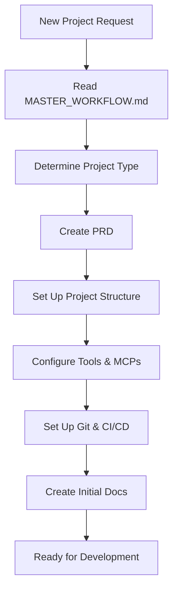

# PROJECT INITIALIZATION TEMPLATE
**Version:** 1.0.0
**Last Updated:** 2025-10-10
**Purpose:** Step-by-step checklist for initializing ANY new project with Claude Code

---

## ⚠️ **DO NOT MODIFY THIS DOCUMENT**

**This is a REFERENCE document. Exception:** Only modify if user explicitly requests.

---

## 🚀 PROJECT INITIALIZATION WORKFLOW



---

## 📋 STEP 1: READ CORE DOCUMENTS

Before starting ANY project:

- [ ] Read [MASTER_WORKFLOW.md](MASTER_WORKFLOW.md)
- [ ] Read [01_PRD_CREATION.md](01_PRD_CREATION.md)
- [ ] Skim [10_ARCHITECTURE_PATTERNS.md](10_ARCHITECTURE_PATTERNS.md)

---

## 🎯 STEP 2: DETERMINE PROJECT TYPE

Ask user and determine:

```markdown
**Project Type:** [ ] Web App [ ] Game [ ] Desktop [ ] Mobile [ ] Other

**Tech Stack Preference:** (or recommend based on 09_LIBRARY_REGISTRY.md)
- Frontend: __________
- Backend: __________
- Database: __________
- Hosting: __________

**Key Features:**
1. __________
2. __________
3. __________

**Timeline:** __________
```

---

## 🏗️ STEP 3: CREATE PROJECT STRUCTURE

### A. Initialize Git Repository

```bash
mkdir my-project
cd my-project
git init
git branch -M main
```

### B. Create `.gitignore`

```bash
# .gitignore
node_modules/
.env
.env.local
.next/
dist/
build/
*.log
.DS_Store
```

### C. Initialize Project (Example: Next.js)

```bash
# Next.js + TypeScript + Tailwind
npx create-next-app@latest . --typescript --tailwind --app --no-src

# Install essential dependencies
npm install zustand @tanstack/react-query
npm install -D @types/node vitest @testing-library/react

# Or SvelteKit
npm create svelte@latest
```

### D. Create Folder Structure

Based on `10_ARCHITECTURE_PATTERNS.md`:

```bash
mkdir -p components/{ui,features,layout}
mkdir -p lib/{supabase,utils}
mkdir -p hooks
mkdir -p types
mkdir -p tests/{unit,integration,e2e}
mkdir -p docs
```

---

## 🔧 STEP 4: CONFIGURE TOOLS

### A. TypeScript (if applicable)

```json
// tsconfig.json - Ensure strict mode
{
  "compilerOptions": {
    "strict": true,
    "noUncheckedIndexedAccess": true,
    "noImplicitReturns": true,
    "paths": {
      "@/*": ["./*"]
    }
  }
}
```

### B. ESLint

```bash
npm install -D eslint @typescript-eslint/parser @typescript-eslint/eslint-plugin
```

```json
// .eslintrc.json
{
  "extends": ["next/core-web-vitals", "plugin:@typescript-eslint/recommended"],
  "rules": {
    "complexity": ["error", 10],
    "max-lines": ["error", 300],
    "max-lines-per-function": ["error", 50]
  }
}
```

### C. Prettier

```bash
npm install -D prettier
```

```json
// .prettierrc
{
  "semi": true,
  "trailingComma": "es5",
  "singleQuote": true,
  "printWidth": 100
}
```

### D. Vitest (Testing)

```bash
npm install -D vitest @vitejs/plugin-react @testing-library/react @testing-library/jest-dom
```

```typescript
// vitest.config.ts
import { defineConfig } from 'vitest/config';
import react from '@vitejs/plugin-react';

export default defineConfig({
  plugins: [react()],
  test: {
    environment: 'jsdom',
    globals: true,
    setupFiles: ['./tests/setup.ts'],
  },
});
```

### E. Playwright (E2E)

```bash
npm install -D @playwright/test
npx playwright install
```

---

## 🔐 STEP 5: SET UP ENVIRONMENT VARIABLES

```bash
# Create .env.example (commit this)
cat > .env.example << 'EOF'
# Database
DATABASE_URL=

# Supabase
NEXT_PUBLIC_SUPABASE_URL=
NEXT_PUBLIC_SUPABASE_ANON_KEY=
SUPABASE_SERVICE_ROLE_KEY=

# Sentry (optional)
SENTRY_DSN=

# Other
NEXT_PUBLIC_APP_URL=http://localhost:3000
EOF

# Create .env.local (DO NOT commit)
cp .env.example .env.local

# Add values
echo "DATABASE_URL=postgres://..." >> .env.local
```

---

## 📦 STEP 6: SET UP MCPs

Consult `08_MCP_TOOLS_REGISTRY.md` and install recommended MCPs:

```json
// .mcp.json
{
  "mcpServers": {
    "linear": {
      "type": "http",
      "url": "https://mcp.linear.app/mcp"
    }
  }
}
```

**Priority MCPs to install:**
1. Semgrep (security - critical)
2. Perplexity (research - high)
3. Supabase (if using Supabase)
4. Sentry (monitoring - high)

---

## 🔄 STEP 7: SET UP GIT & CI/CD

### A. GitHub Repository

```bash
# Create repo on GitHub, then:
git remote add origin git@github.com:username/my-project.git
git add .
git commit -m "chore: initial project setup"
git push -u origin main
```

### B. CI/CD (GitHub Actions)

```yaml
# .github/workflows/ci.yml
name: CI

on: [push, pull_request]

jobs:
  test:
    runs-on: ubuntu-latest
    steps:
      - uses: actions/checkout@v4
      - uses: actions/setup-node@v4
        with:
          node-version: '20'
      - run: npm ci
      - run: npm run lint
      - run: npm test
      - run: npm run build
```

---

## 📝 STEP 8: CREATE INITIAL DOCUMENTATION

```bash
# docs/ARCHITECTURE.md
# docs/DEVELOPMENT.md
# CHANGELOG.md (start empty)
```

```markdown
# README.md

# [Project Name]

## Tech Stack
- Frontend: Next.js 15 + TypeScript
- Styling: Tailwind CSS
- Database: Supabase (Postgres)
- Hosting: Vercel

## Getting Started

\`\`\`bash
npm install
cp .env.example .env.local  # Add your values
npm run dev
\`\`\`

Open http://localhost:3000

## Testing

\`\`\`bash
npm test                 # Unit tests
npm run test:e2e         # E2E tests
npm test -- --coverage   # Coverage report
\`\`\`

## Deployment

\`\`\`bash
vercel --prod
\`\`\`

## Documentation

- [Architecture](docs/ARCHITECTURE.md)
- [Development Guide](docs/DEVELOPMENT.md)
- [Claude Code Workflow](../Claude%20DOCS/MASTER_WORKFLOW.md)
```

---

## ✅ PROJECT INITIALIZATION CHECKLIST

### Setup Complete When:
- [ ] Project structure created (following 10_ARCHITECTURE_PATTERNS.md)
- [ ] Git initialized and first commit made
- [ ] Dependencies installed
- [ ] TypeScript configured (strict mode)
- [ ] ESLint + Prettier configured
- [ ] Testing framework set up (Vitest + Playwright)
- [ ] Environment variables configured (.env.example created)
- [ ] MCPs installed (at least Semgrep)
- [ ] GitHub repo created and linked
- [ ] CI/CD configured (GitHub Actions)
- [ ] README created with setup instructions
- [ ] First test passes (`npm test` works)
- [ ] Dev server runs (`npm run dev` works)

---

## 🎯 NEXT STEPS AFTER INITIALIZATION

1. **Create PRD** - Follow `01_PRD_CREATION.md`
2. **Build Static UI** - Follow `02_STATIC_UI_MOCKUP.md`
3. **Generate Tasks** - Follow `03_TASK_GENERATION.md`
4. **Start Implementation** - Follow `04_IMPLEMENTATION.md`

---

## 🔗 RELATED DOCUMENTS

- [MASTER_WORKFLOW.md](MASTER_WORKFLOW.md) - Main workflow
- [01_PRD_CREATION.md](01_PRD_CREATION.md) - First development step
- [10_ARCHITECTURE_PATTERNS.md](10_ARCHITECTURE_PATTERNS.md) - Structure reference

---

**Project initialized! Ready to build something amazing! 🚀**
